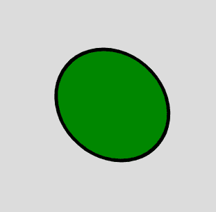

# p5.js |排版| shearX()功能

> 原文:[https://www . geesforgeks . org/P5-js-排版-shearx-function/](https://www.geeksforgeeks.org/p5-js-typography-shearx-function/)

p5.js 中的 **shearX()函数**用于围绕 x 轴剪切形状或对象。对象被剪切了角度参数指定的量。为了使角度正常工作，应在当前角度模式下进行指定。对象总是围绕其相对于原点的位置沿顺时针方向剪切。

**语法:**

```
shearX(angle)
```

**参数:**该功能接受单参数**角度**，存储角度值。

下面的程序说明了 p5.js 中的 shearX()函数:

**示例 1:** 本示例使用 shearX()函数在 x 轴上剪切对象。

```
function setup() {

    // Create Canvas of given size
    createCanvas(780, 650);
}

function draw() {

    // Set the background color
    background(220);

    // Set fill color
    fill('lightgreen');

    // Set stroke width
    strokeWeight(5);

    // Set shearX function
    shearX(PI/6);

    // Finally Draw the sheared rectangle
    rect(30, 30, 400, 300);
}
```

**输出:**


**示例 2:** 本示例使用 shearX()函数在 x 轴上剪切对象。

```
function setup() {

    // Create Canvas of given size
    createCanvas(780, 650);
}

function draw() {

    // Set the background color
    background(220);

    // Set fill color
    fill('green');

    // Set stroke width
    strokeWeight(5);

    // Set shearX function
    shearX(PI/20);

    // Finally Draw the sheared
    // circle of radius 80 
    circle(height/2, width/2, 80);
}
```

**输出:**

**参考:**[https://p5js.org/reference/#/p5/shearX](https://p5js.org/reference/#/p5/shearX)