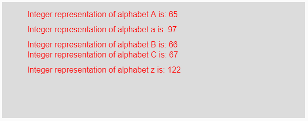
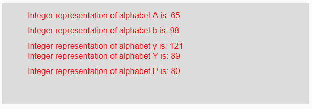

# p5.js | unchar()函数

> 原文:[https://www.geeksforgeeks.org/p5-js-unchar-function/](https://www.geeksforgeeks.org/p5-js-unchar-function/)

p5.js 中的 **unchar()函数**用于将单个字符串转换为其对应的整数表示。这个函数与 char()函数正好相反。

**语法:**

```
unchar(value)
```

**参数:**该函数接受单个参数**值**，该值将被转换为其对应的整数表示。该值可以是任何单字符字符串或单字符数组。

**返回值:**返回转换后的单字符串整数表示形式。

下面的程序说明了 p5.js 中的 unchar()函数:

**示例 1:** 本示例使用 unchar()函数将单个字符串转换为其对应的整数表示形式。

```
function setup() { 

    // Creating Canvas size
    createCanvas(600, 230); 
} 

function draw() { 

    // Set the background color 
    background(220); 

    // Initializing some values
    let Value1 = "A";
    let Value2 = "a";
    let Value3 = "B";
    let Value4 = "C"; 
    let Value5 = "z";

    // Calling to unchar() function.
    let A = unchar(Value1);
    let B = unchar(Value2);
    let C = unchar(Value3);
    let D = unchar(Value4);
    let E = unchar(Value5);

    // Set the size of text 
    textSize(16); 

    // Set the text color 
    fill(color('red')); 

    // Getting integer representation
    text("Integer representation of alphabet A is: " + A, 50, 30);
    text("Integer representation of alphabet a is: " + B, 50, 60);
    text("Integer representation of alphabet B is: " + C, 50, 90);
    text("Integer representation of alphabet C is: " + D, 50, 110);
    text("Integer representation of alphabet z is: " + E, 50, 140);
} 
```

**输出:**


**示例 2:** 本示例使用 unchar()函数将单个字符串转换为其对应的整数表示形式。

```
function setup() { 

    // Creating Canvas size
    createCanvas(600, 200); 
} 

function draw() { 

    // Set the background color 
    background(220); 

    // Calling to unchar() function.
    let A = unchar("A");
    let B = unchar("b");
    let C = unchar("y");
    let D = unchar("Y");
    let E = unchar("P");

    // Set the size of text 
    textSize(16); 

    // Set the text color 
    fill(color('red')); 

    // Getting integer representation
    text("Integer representation of alphabet A is: " + A, 50, 30);
    text("Integer representation of alphabet b is: " + B, 50, 60);
    text("Integer representation of alphabet y is: " + C, 50, 90);
    text("Integer representation of alphabet Y is: " + D, 50, 110);
    text("Integer representation of alphabet P is: " + E, 50, 140);
}    
```

**输出:**


**参考:**T2】https://p5js.org/reference/#/p5/unchar