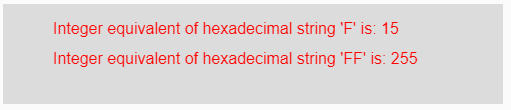
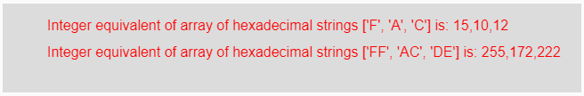

# P5 . js | unhx()功能

> 原文:[https://www.geeksforgeeks.org/p5-js-unhex-function/](https://www.geeksforgeeks.org/p5-js-unhex-function/)

p5.js 中的**unhx()函数**用于*将任意输入十六进制数的字符串表示转换为其等效的整数值。*

**语法:**

```
unhex(String)
```

**参数:**这个函数接受一个参数**字符串**，它是一个十六进制数，要转换成它的整数等值。此参数也可能是十六进制数字的字符串数组。

**返回值:**返回*转换后的整数表示*。

下面的程序说明了 p5.js.
**中的**unhx()**功能示例-1:**

```
function setup() {

    // Creating Canvas size
    createCanvas(500, 100);
}

function draw() {

    // Set the background color 
    background(220);

    // Initializing some strings
    let String1 = "F";
    let String2 = "FF";

    // Calling to unhex() function.
    let A = unhex(String1);
    let B = unhex(String2);

    // Set the size of text 
    textSize(16);

    // Set the text color 
    fill(color('red'));

    // Getting integer equivalent
    text("Integer equivalent of hexadecimal string 'F' is: "
         + A, 50, 30);
    text("Integer equivalent of hexadecimal string 'FF' is: "
         + B, 50, 60);

}
```

**输出:**


**示例-2:**

```
function setup() {

    // Creating Canvas size
    createCanvas(650, 100);
}

function draw() {

    // Set the background color 
    background(220);

    // Initializing some strings
    let String1 = ["F", "A", "C"];
    let String2 = ["FF", "AC", "DE"];

    // Calling to unhex() function.
    let A = unhex(String1);
    let B = unhex(String2);

    // Set the size of text 
    textSize(16);

    // Set the text color 
    fill(color('red'));

    // Getting integer equivalent
    text("Integer equivalent of array of hexadecimal strings"+
         " ['F', 'A', 'C'] is: " 
         + A, 50, 30);
    text("Integer equivalent of array of hexadecimal strings"+
         " ['FF', 'AC', 'DE'] is: "
         + B, 50, 60);

}
```

**输出:**


**参考:**T2】https://p5js.org/reference/#/p5/unhex