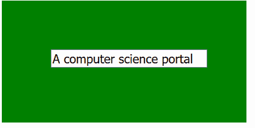

# p5.js | value()函数

> 原文:[https://www.geeksforgeeks.org/p5-js-value-function/](https://www.geeksforgeeks.org/p5-js-value-function/)

**值()函数**是一个内置函数，用于设置或返回元素的值。
此功能需要 p5.dom 库。所以在**index.html**文件的头部增加下面一行。

## java 描述语言

```
<script language="javascript"
    type="text/javascript" src="path/to/p5.dom.js">
</script>
```

**语法:**

```
value()
```

或者

```
value( value )
```

**参数:**该函数接受单个参数**值**，该值以数字或字符串格式保存。
**返回值:**该函数返回元素的值。
以下示例说明了 p5.js:
**中的 value()函数示例 1:** 本示例使用 value()函数将值显示为输出。

## java 描述语言

```
// Gets the value
var input_val;

function setup() {

    // Canvas size 400*400
    createCanvas(400, 200);

    // Set background color
    background('green');

    // Create an input element with its value
    input_val = createInput('Welcome to GeeksforGeeks'); 

    // Set the position of div element
    input_val.position(30, 80);

    // Set width of input field
    input_val.style('width', '250px');

    // Set font-size of input text
    input_val.style('font-size', '20px');

    // Set margin property
    input_val.style('margin-left', '50px');
}

function mousePressed() {

    // Display the input value
    print(input_val.value());
}
```

**输出:**


**示例 2:** 本示例使用 value()函数设置元素的值。

## java 描述语言

```
// Set the input value
var input_val;

function setup() {

    // Canvas size 400*400
    createCanvas(400, 200);

    // Set background color
    background('green');

    // Create an input element with its value
    input_val = createInput('Welcome to GeeksforGeeks'); 

    // Set the position of div element
    input_val.position(30, 80);

    // Set width of input field
    input_val.style('width', '250px');

    // Set font-size of input text
    input_val.style('font-size', '20px');

    // Set margin property
    input_val.style('margin-left', '50px');
}

function mousePressed() {

    // Change input value
    input_val.value('A computer science portal');
}
```

**输出:**

*   **之前点击元素:**


*   **点击元素后:**

