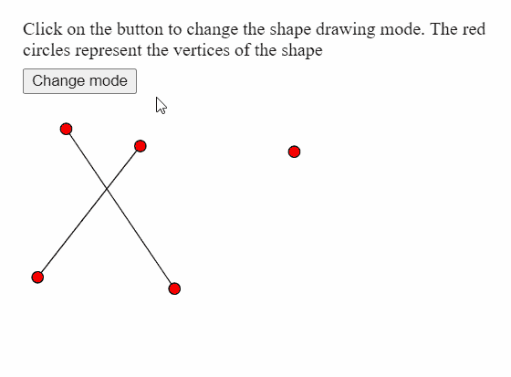
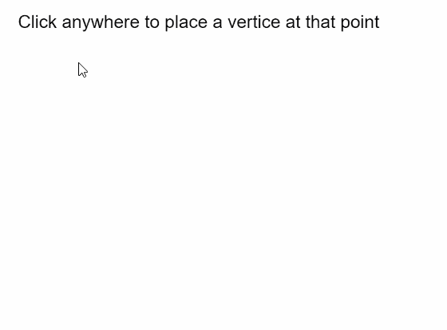

# p5.js | vertex()函数

> 原文:[https://www.geeksforgeeks.org/p5-js-vertex-function/](https://www.geeksforgeeks.org/p5-js-vertex-function/)

p5.js 中的**顶点()函数**用于指定用于绘制形状的顶点的坐标。只能和 **beginShape()** 和 **endShape()** 功能一起使用，制作点、线、三角形、四边形、多边形等各种形状和曲线。

**语法:**

```
vertex( x, y )
```

运筹学

```
vertex( x, y, z, [u], [v] )
```

**参数:**该功能接受五个参数，如上所述，描述如下:

*   **x:** 是指定顶点 x 坐标的数字。
*   **y:** 是指定顶点 y 坐标的数字。
*   **z:** 是指定顶点 z 坐标的数字。
*   **u:** 是指定顶点纹理的 u 坐标的数字。这是一个可选参数。
*   **v:** 是指定顶点纹理的 v 坐标的数字。这是一个可选参数。

下面的例子说明了 p5.js 中的**顶点()函数**:

**例 1:**

```
let currMode;

function setup() {
  createCanvas(400, 300);
  textSize(18);

  let shapeModes = [LINES, TRIANGLES, TRIANGLE_FAN, 
                    TRIANGLE_STRIP, QUADS];
  let index = 0;
  currMode = shapeModes[index];

  let helpText = createP(
    `Click on the button to change the shape drawing mode.
    The red circles represent the vertices of the shape`
  );
  helpText.position(20, 0);

  let closeBtn = createButton("Change mode");
  closeBtn.position(20, 60);
  closeBtn.mouseClicked(() => {
    if (index < shapeModes.length) index++;
    else index = 0;
    currMode = shapeModes[index];
  });
}

function draw() {
  clear();

  // Starting the shape using beginShape()
  beginShape(currMode);

  // Specifying all the vertices
  vertex(145, 245);
  vertex(50, 105);
  vertex(25, 235);
  vertex(115, 120);
  vertex(250, 125);

  // Ending the shape using endShape()
  endShape();

  // Points for demonstration
  fill("red");
  circle(145, 245, 10);
  circle(50, 105, 10);
  circle(25, 235, 10);
  circle(115, 120, 10);
  circle(250, 125, 10);
  noFill();
}
```

**输出:**



**例 2:**

```
let vertices = [];

function setup() {
  createCanvas(400, 300);
  textSize(18);
  text("Click anywhere to place a vertice "+
       "at that point", 10, 20);
}

function mouseClicked() {
  // Update the vertices array with
  // current mouse position
  vertices.push({ x: mouseX, y: mouseY });

  clear();
  fill("black");
  text("Click anywhere to place a vertice "+
       "at that point", 10, 20);

  noFill();

  // Draw shape using the current vertices array
  beginShape();
  for (let i = 0; i < vertices.length; i++)
    vertex(vertices[i].x, vertices[i].y);
  endShape(CLOSE);

  fill("red");
  // Draw a circle at all the vertices
  for (let i = 0; i < vertices.length; i++)
    circle(vertices[i].x, vertices[i].y, 15);
}
```

**输出:**



**在线编辑:**[https://editor.p5js.org/](https://editor.p5js.org/)

**环境设置:**

**参考:**T2】https://p5js.org/reference/#/p5/vertex