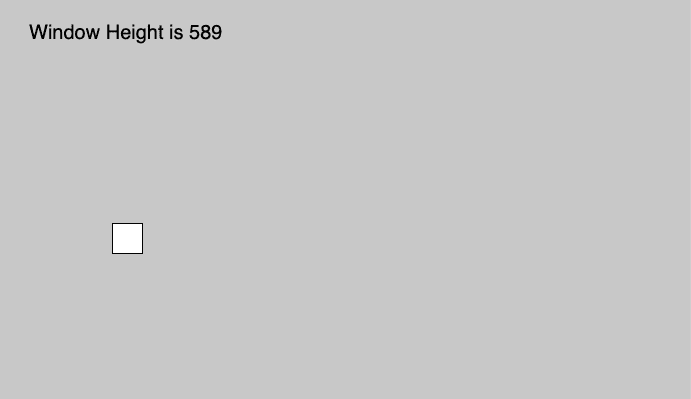
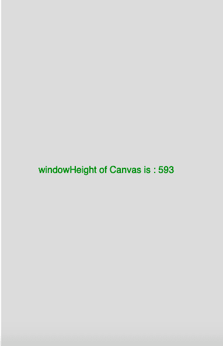

# T0% p5.js |窗口高

> 哎哎哎::1230【https://www . geeksforgeeks . org/P5-js-windowheight/

p5.js 中的 **windowHeight** 是一个系统变量，用来存储内窗的高度，它映射到 window.innerHeight.
**语法**

```
windowHeight

```

**参数:**此功能不接受任何参数。

下面的程序说明了 p5.js 中的 windowHeight 变量:
**示例-1:**

```
function setup() {

    createCanvas(1000, 400);

    // Set text size to 40px
    textSize(20);
}

function draw() {
    background(200);
    rect(mouseX, mouseY, 30, 30);

    //Use of windowHeight Variable
    text("Window Height is " + windowHeight, 30, 40);
}
```

**输出:**


**示例-2:**

```
function setup() {

    // set height to window height 
    height = windowHeight;

    //create Canvas of size 380*80 
    createCanvas(380, height);
}

function draw() {
    background(220);
    textSize(16);
    textAlign(CENTER);
    fill(color('Green'));

    //use of windowHeight variable
    text("windowHeight of Canvas is : "
         + height, 180, height / 2);
}
```

**输出:**


**参考:**T2】https://p5js.org/reference/#/p5/windowHeight