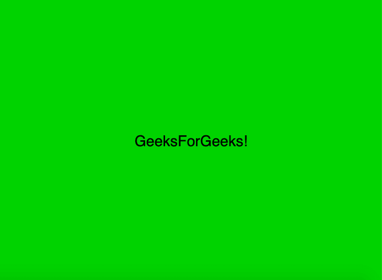
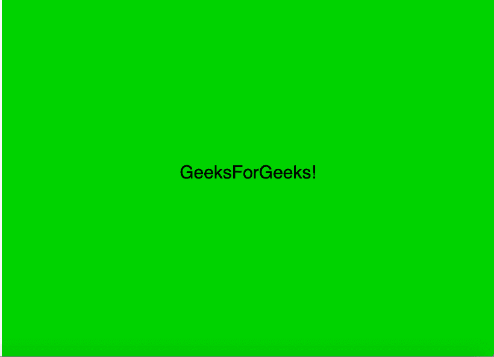
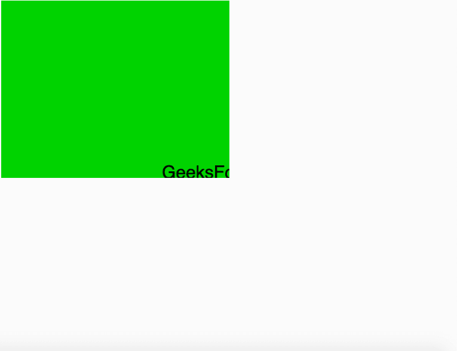

# P5 . js | windowsTaggered()函数

> 原文:[https://www.geeksforgeeks.org/p5-js-windowresized-function/](https://www.geeksforgeeks.org/p5-js-windowresized-function/)

p5.js 中的 **windowResized()** 函数在每次浏览器窗口调整大小时被*调用一次。只要窗口的大小增加，它就会自动调整高度和宽度。一旦调整了窗口的大小，就会自动调用这个函数，然后创建一个与之对应的新画布。*

**语法:**

```
windowResized()

```

**参数:**此功能不接受任何参数。

下面的程序说明了 p5.js:
**中的 **windowResized()** 函数示例-1:**

```
function setup() {

    createCanvas(windowWidth, windowHeight);
}

function draw() {
    background(0, 200, 0);
    color("green");
    textSize(30);
    textAlign(CENTER);
    text("GeeksForGeeks!", 
         windowWidth / 2, 
         windowHeight / 2);
}

// Definition of windowResized Function
function windowResized() {
    resizeCanvas(windowWidth, windowHeight);
}
```

**输出:**


**示例-2:**

```
function setup() {
    createCanvas(windowWidth, windowHeight);
}

function draw() {
    background(0, 200, 0);
    color("green");
    textSize(30);
    textAlign(CENTER);
    text("GeeksForGeeks!", 
         windowWidth / 2, 
         windowHeight / 2);
}

// Definition of windowResized Function
function windowResized() {
    resizeCanvas(windowWidth / 2, windowHeight / 2);
}
```

**输出:**
**调整大小前:**


**调整大小后:**


**参考:**T2】https://p5js.org/reference/#/p5/windowResized