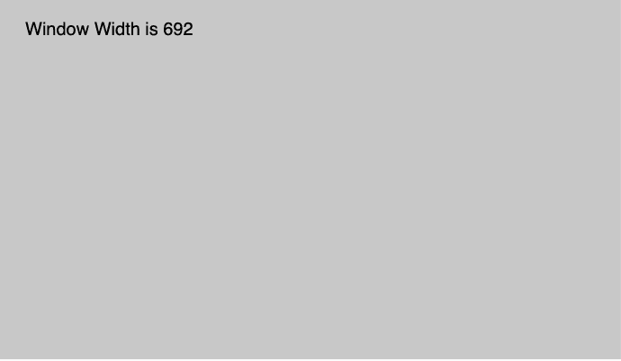

# p5.js \ windowswidth

的缩写形式

> 哎哎哎::1230【https://www . geeksforgeeks . org/P5-js-windowwidth/

p5.js 中的 **windowWidth** 变量是一个系统变量，用于*存储内窗*的宽度，映射到 **window.innerWidth** 。
**语法:**

```
windowWidth

```

**参数:**此功能不接受任何参数。

下面的程序说明了 p5.js 中的 windowWidth 变量:
**示例-1:**

```
function setup() {

    createCanvas(1000, 400);

    // Set text size to 40px
    textSize(20);
}

function draw() {
    background(200);

    rect(mouseX, mouseY, 30, 30);

    //Use of windowWidth Variable
    text("Window Width is " + windowWidth, 30, 40);
}
```

**输出:**


**示例-2:**

```
function setup() {

    // set height to window width 
    width = windowWidth;

    //create Canvas of size 380*80 
    createCanvas(width, 100);
}

function draw() {
    background(220);
    textSize(16);
    textAlign(CENTER);
    fill(color('Green'));

    //use of windowWidth variable
    text("windowWidth of Canvas is : "
         + width, width / 2, height / 2);
}
```

**输出:**


**参考:**T2】https://p5js.org/reference/#/p5/windowWidth