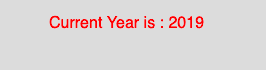

# p5.js | year()功能

> 原文:[https://www.geeksforgeeks.org/p5-js-year-function/](https://www.geeksforgeeks.org/p5-js-year-function/)

p5.js 中的 **year()函数**用于从系统时钟返回当前年份。它返回一个代表当前年份的整数值。

**语法:**

```
year()
```

**参数:**函数不接受任何参数。

**返回值:**返回一个代表当前年份的整数值。

下面的程序说明了 p5.js 中的 year()函数:

**示例:**本示例使用 year()函数从系统时钟返回当前年份。

```
function setup() {

    // Create Canvas of given size
    createCanvas(270, 80);
}

function draw() {

    // Set the background color
    background(220);

    // Initialize the parameter with current year
    let y = year();

    // Set the font size
    textSize(16);

    // Set the font color
    fill(color('red'));

    // Display result
    text("Current Year is : " + y, 50, 30);
}
```

**输出:**


**参考:**T2】https://p5js.org/reference/#/p5/year