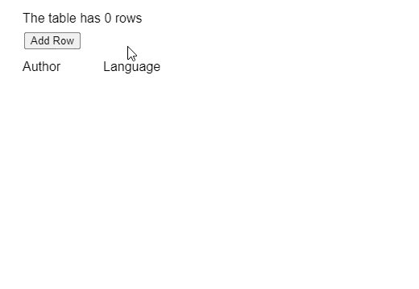
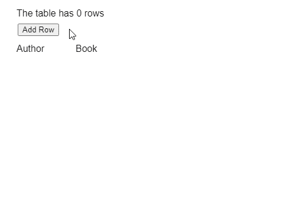

# p5。表 addRow()方法

> 原文:[https://www.geeksforgeeks.org/p5-table-addrow-method/](https://www.geeksforgeeks.org/p5-table-addrow-method/)

p5 的 **addRow()方法**。p5.js 中的 Table 用于向 table 对象添加新的数据行。默认情况下，此方法创建一个空行。这可以通过存储对新行对象的引用，然后使用 **set()** 方法设置行中的值来实现。或者，p5。TableRow 对象可以作为方法的参数。这将直接复制给定的行并将其添加到表中。

**语法:**

```
addRow( [row] )

```

**参数:**该函数接受如上所述的单个参数，如下所述:

*   **排:**是 p5。TableRow 对象，指定要添加到表中的行。这是一个可选参数。

下面的例子说明了 p5.js 中的 **addRow()函数**:

**例 1:**

## java 描述语言

```
function setup() {
  createCanvas(500, 300);
  textSize(16);

  addRowBtn = createButton("Add Row");
  addRowBtn.position(30, 40);
  addRowBtn.mouseClicked(addNewRow);

  // Create the table
  table = new p5.Table();

  table.addColumn("author");
  table.addColumn("langauge");
}

function addNewRow() {
  // Create new row object
  let newRow = table.addRow();

  // Add data to it using setString()
  newRow.setString("author", "Author " + floor(random(1, 100)));
  newRow.setString("langauge", "Langauge " + floor(random(1, 100)));
}

function draw() {
  clear();

  // Show the total number of rows
  text("The table has " + table.getRowCount() + " rows", 20, 20);

  // Show the columns
  text("Author", 20, 80);
  text("Language", 120, 80);

  // Show the table with the rows
  for (let r = 0; r < table.getRowCount(); r++)
    for (let c = 0; c < table.getColumnCount(); c++)
      text(table.getString(r, c), 20 + c * 100, 120 + r * 20);
}
```

**输出:**



**例 2:**

## java 描述语言

```
function setup() {
  createCanvas(500, 300);
  textSize(16);

  addRowBtn = createButton("Add Row");
  addRowBtn.position(30, 40);
  addRowBtn.mouseClicked(addNewRow);

  // Create the table
  table = new p5.Table();

  table.addColumn("author");
  table.addColumn("book");

}

function addNewRow() {

  // Create a new TableRow object
  let tableRow = new p5.TableRow("Author X, Book Y", ",");

  // Add the TableRow to table
  table.addRow(tableRow);
}

function draw() {
  clear();

  // Show the total number of rows
  text("The table has " + table.getRowCount() + " rows", 20, 20);

  // Show the columns
  text("Author", 20, 80);
  text("Book", 120, 80);

  // Show the table with the rows
  for (let r = 0; r < table.getRowCount(); r++)
    for (let c = 0; c < table.getColumnCount(); c++)
      text(table.getString(r, c), 20 + c * 100, 120 + r * 20);
}
```

**输出:**



**在线编辑:**[【https://editor.p5js.org/】](https://editor.p5js.org/)
**环境设置:**[https://www . geeksforgeeks . org/P5-js-soundfile-object-installation-and-methods/](https://www.geeksforgeeks.org/p5-js-soundfile-object-installation-and-methods/)
**参考:**[https://p5js.org/reference/#/p5.Table/addRow](https://p5js.org/reference/#/p5.Table/addRow)