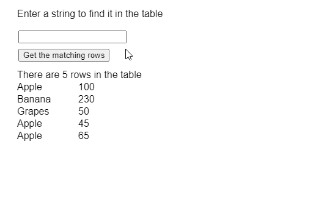
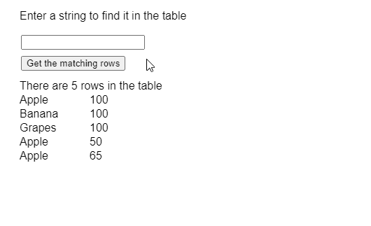

# p5。表查找行()方法

> 原文:[https://www.geeksforgeeks.org/p5-table-findrows-method/](https://www.geeksforgeeks.org/p5-table-findrows-method/)

p5 的 **findRows()方法**。p5.js 中的表用于查找包含给定 and 值的所有行，并返回对这些行的引用。方法搜索的列可以指定为参数。

**语法:**

```
findRows( value, column )
```

**参数:**该函数接受两个参数，如上所述，如下所述:

*   **值:**是指定必须匹配的值的字符串。
*   **列:**是表示要搜索的列的列名或列标识的字符串或数字。

下面的例子说明了 p5.js 中的 **findRows()方法**:

**例 1:**

```
function setup() {
  createCanvas(500, 300);
  textSize(16);

  findQueryInput = createInput();
  findQueryInput.position(30, 50);

  getColBtn =
    createButton("Get the matching rows");
  getColBtn.position(30, 80);
  getColBtn.mouseClicked(getFindResults);

  // Create the table
  table = new p5.Table();

  // Add two columns
  table.addColumn("fruit");
  table.addColumn("price");

  // Add some rows to the table
  let newRow = table.addRow();
  newRow.setString("fruit", "Apple");
  newRow.setString("price", 100);

  newRow = table.addRow();
  newRow.setString("fruit", "Banana");
  newRow.setString("price", 230);

  newRow = table.addRow();
  newRow.setString("fruit", "Grapes");
  newRow.setString("price", 50);

  newRow = table.addRow();
  newRow.setString("fruit", "Apple");
  newRow.setString("price", 45);

  newRow = table.addRow();
  newRow.setString("fruit", "Apple");
  newRow.setString("price", 65);

  showTable();
}

function getFindResults() {
  clear();

  let findQuery = findQueryInput.value();

  // Get the row values using findRows()
  if (findQuery != "") {

    // Find the results in the column of 'fruit' 
    findResults =
      table.findRows(findQuery, 'fruit');

    if (findResults.length > 0) {
      text("The rows that match the query are",
           20, 120);

      // Display the matched rows
      for (let i = 0; i < findResults.length; i++) {

        text(findResults[i].arr[0],
             20, 140 + i * 20);
        text(findResults[i].arr[1],
             120, 140 + i * 20);
      }
    }
    else text("No Results Found", 20, 120); 

  } else
    text("The query string is empty", 20, 120);

    text("Enter a string to find it" +
         " in the table", 20, 20);
}

function showTable() {
  clear();

  // Display the total rows
  // present in the table
  text("There are " +
       table.getRowCount() +
       " rows in the table", 20, 120);

  for (let r = 0; r < table.getRowCount(); r++)
    for (let c = 0; c < table.getColumnCount(); c++)
      text(table.getString(r, c),
           20 + c * 100, 140 + r * 20);

      text("Enter a string to find it" +
           " in the table", 20, 20);
}
```

**输出:**



**例 2:**

```
function setup() {
  createCanvas(500, 300);
  textSize(16);

  findQueryInput = createInput();
  findQueryInput.position(30, 50);

  getColBtn = 
    createButton("Get the matching rows");
  getColBtn.position(30, 80);
  getColBtn.mouseClicked(getFindResults);

  // Create the table
  table = new p5.Table();

  // Add two columns
  table.addColumn("fruit");
  table.addColumn("price");

  // Add some rows to the table
  let newRow = table.addRow();
  newRow.setString("fruit", "Apple");
  newRow.setString("price", 100);

  newRow = table.addRow();
  newRow.setString("fruit", "Banana");
  newRow.setString("price", 100);

  newRow = table.addRow();
  newRow.setString("fruit", "Grapes");
  newRow.setString("price", 100);

  newRow = table.addRow();
  newRow.setString("fruit", "Apple");
  newRow.setString("price", 50);

  newRow = table.addRow();
  newRow.setString("fruit", "Apple");
  newRow.setString("price", 65);

  showTable();
}

function getFindResults() {
  clear();

  let findQuery =
      findQueryInput.value();

  // Get the row values using findRows()
  if (findQuery != "") {

    // Find the results in the column of 'price' 
    findResults =
      table.findRows(findQuery, 'price');

    if (findResults.length > 0) {
      text("The rows that match the query are",
           20, 120);

      // Display the matched rows
      for (let i = 0; i < findResults.length; i++) {

        text(findResults[i].arr[0],
             20, 140 + i * 20);
        text(findResults[i].arr[1],
             120, 140 + i * 20);
      }
    }
    else text("No Results Found", 20, 120);

  } else
    text("The query string is empty", 20, 120);

  text("Enter a string to find it" + 
       " in the table", 20, 20);
}

function showTable() {
  clear();

  // Display the total rows
  // present in the table
  text("There are " +
       table.getRowCount() +
       " rows in the table",
       20, 120);

  for (let r = 0; r < table.getRowCount(); r++)
    for (let c = 0; c < table.getColumnCount(); c++)
      text(table.getString(r, c),
           20 + c * 100,
           140 + r * 20);

  text("Enter a string to find it" + 
       " in the table", 20, 20);
}
```

**输出:**



**在线编辑:**[https://editor.p5js.org/](https://editor.p5js.org/)

**环境设置:**

**参考:**T2】https://p5js.org/reference/#/p5.Table/findRows