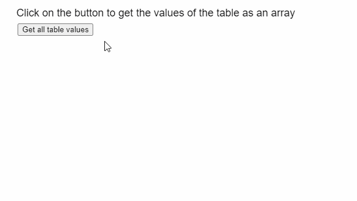
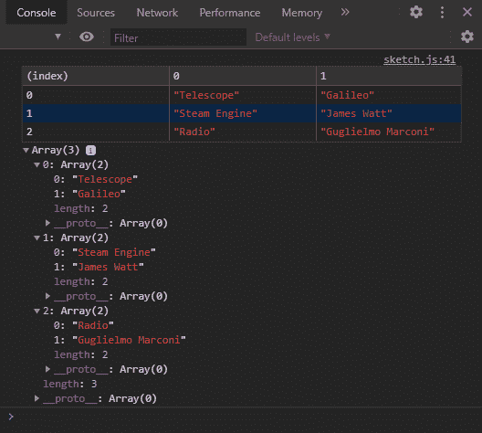

# p5。表 getArray()方法

> 原文:[https://www.geeksforgeeks.org/p5-table-getarray-method/](https://www.geeksforgeeks.org/p5-table-getarray-method/)

p5 的 **getArray()方法**。p5.js 中的 Table 用于以多维数组的形式检索表中的所有数据。可以迭代这个数组来获取表中的所有值。

**语法:**

```
getArray()

```

**参数:**此方法不接受任何参数。

**返回值:**这个方法返回一个包含表中所有数据的多维数组。

下面的例子说明了 p5.js 中的 **getArray()方法**:

**示例:**

## java 描述语言

```
function setup() {
  createCanvas(600, 300);
  textSize(18);

  text("Click on the button to get the " +
       "values of the table as an array",
       20, 20);

  setBtn =
    createButton("Get all table values");
  setBtn.position(30, 40);
  setBtn.mouseClicked(showTable);

  // Create the table
  table = new p5.Table();

  setTableData();
}

function setTableData() {
  table.addColumn('Invention');
  table.addColumn('Inventors');

  let tableRow = table.addRow();
  tableRow.setString('Invention', 'Telescope');
  tableRow.setString('Inventors', 'Galileo');

  tableRow = table.addRow();
  tableRow.setString('Invention', 'Steam Engine');
  tableRow.setString('Inventors', 'James Watt');

  tableRow = table.addRow();
  tableRow.setString('Invention', 'Radio');
  tableRow.setString('Inventors', 'Guglielmo Marconi');
}

function showTable() {
  clear();
  text("All values of the table are retrieved " +
       "using the getArray() method", 20, 20);

  // Get all the values in the table as an array
  let tableArray = table.getArray();
  console.table(tableArray);

  // Show all the rows currently
  // present in the multi-dimensional array
  for (let r = 0; r < tableArray.length; r++) {
    for (let c = 0; c < tableArray[0].length; c++) {
      text(str(tableArray[r]),
           20 + 160 * c, 100 + 20 * r);
    }
  }
}
```

**输出:**



**控制台输出:**



**在线编辑:**[https://editor.p5js.org/](https://editor.p5js.org/)

**环境设置:**

**参考:**T2】https://p5js.org/reference/#/p5.Table/getArray