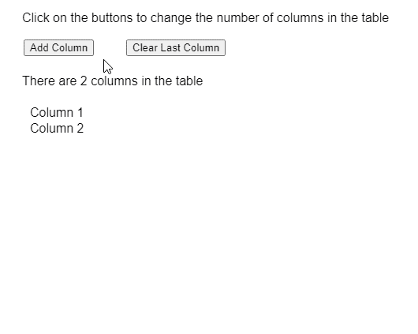

# p5。表 getColumnCount()方法

> 原文:[https://www . geesforgeks . org/P5-table-getcolumncount-method/](https://www.geeksforgeeks.org/p5-table-getcolumncount-method/)

p5 的 **getColumnCount()方法**。p5.js 中的 Table 用于返回 table 对象中的列总数。

**语法:**

```
getColumnCount()
```

**参数:**此功能不接受任何参数。

**返回值:**返回一个指定表中列数的整数值。

下面的例子说明了 p5.js 中的 **getColumnCount()方法**:

**示例:**

```
let colCount = 3;

function setup() {
  createCanvas(500, 400);
  textSize(16);

  addColBtn = createButton("Add Column");
  addColBtn.position(30, 50);
  addColBtn.mouseClicked(addOneColumn);

  removeColBtn =
    createButton("Clear Last Column");
  removeColBtn.position(160, 50);
  removeColBtn.mouseClicked(clearLastColumn);

  // Create the table
  table = new p5.Table();

  // Add columns
  table.addColumn("Column 1");
  table.addColumn("Column 2");

  // Display the table
  showTable();
}

function clearLastColumn() {
  let lastColumn =
      table.getColumnCount() - 1;
  if (lastColumn >= 0)
    table.removeColumn(lastColumn);

  showTable();
}

function addOneColumn() {
  table.addColumn("Column " + colCount);
  colCount++;

  showTable();
}

function showTable() {
  clear();
  text("Click on the buttons to change" +
       " the number of columns in the table",
       20, 20);

  // Get the number of columns
  // currently in the table
  let columnCount = table.getColumnCount();

  // Display the total columns
  // present in the table
  text("There are " + columnCount + 
       " columns in the table",
       20, 100);

  // Show all the column names
  // currently present in the table
  for (let c = 0; c < columnCount; c++)
    text(table.columns, 30, 140 + c * 20);
}
```

**输出:**


**在线编辑:**[https://editor.p5js.org/](https://editor.p5js.org/)

**环境设置:**

**参考:**T2】https://p5js.org/reference/#/p5.Table/getColumnCount