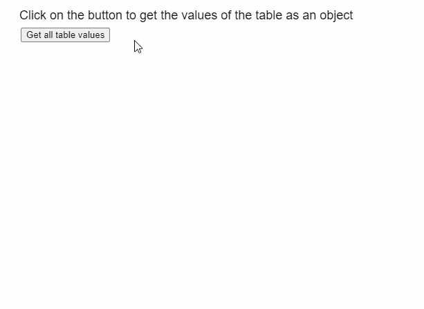

# p5。表 getObject()方法

> 原文:[https://www.geeksforgeeks.org/p5-table-getobject-method/](https://www.geeksforgeeks.org/p5-table-getobject-method/)

p5 的 **getObject()方法**。p5.js 中的 Table 用于以对象的形式检索表中的所有数据。可以指定一个可选的列名来存储该列名作为属性的表的所有行。

**语法:**

```
getObject( [headerColumn] )

```

**参数:**该方法接受如上所述的单个参数，如下所述:

*   **headerColumn:** 它是一个字符串，表示应该用作每个行对象标题的列的名称。

**返回值:**这个方法返回一个包含表中所有数据的对象。

下面的例子说明了 p5.js 中的 **getObject()方法**:

**例 1:**

## java 描述语言

```
function setup() {
  createCanvas(600, 300);
  textSize(18);

  text("Click on the button to get " +
       "the values of the table as an object",
       20, 20);

  setBtn =
    createButton("Get all table values");
  setBtn.position(30, 40);
  setBtn.mouseClicked(showTable);

  // Create the table
  table = new p5.Table();

  setTableData();
}

function setTableData() {
  table.addColumn('Invention');
  table.addColumn('Inventors');

  let tableRow = table.addRow();
  tableRow.setString('Invention', 'Telescope');
  tableRow.setString('Inventors', 'Galileo');

  tableRow = table.addRow();
  tableRow.setString('Invention', 'Steam Engine');
  tableRow.setString('Inventors', 'James Watt');

  tableRow = table.addRow();
  tableRow.setString('Invention', 'Radio');
  tableRow.setString('Inventors', 'Guglielmo Marconi');
}

function showTable() {
  clear();
  text("All values retrieved using the " +
       "getObject() method", 20, 20);

  // Get all the values in the table as an array
  let tableObject = table.getObject();
  console.log(tableObject);

  // Get every row in the table using the length
  // of their keys
  for (let r = 0; r < Object.keys(tableObject).length; r++) {

    // Display the row using the JSON format
    text(JSON.stringify(tableObject[r]), 20, 100 + 30 * r);
  }
}
```

**输出:**



**例 2:**

## java 描述语言

```
function setup() {
  createCanvas(600, 400);
  textSize(18);

  text("Click on the button to get the " + 
       "values of the table as an object",
       20, 20);

  setBtn =
    createButton("Get all table values");
  setBtn.position(30, 40);
  setBtn.mouseClicked(showTable);

  // Create the table
  table = new p5.Table();

  setTableData();
}

function setTableData() {
  table.addColumn('Invention');
  table.addColumn('Inventors');

  let tableRow = table.addRow();
  tableRow.setString('Invention', 'Telescope');
  tableRow.setString('Inventors', 'Galileo');

  tableRow = table.addRow();
  tableRow.setString('Invention', 'Steam Engine');
  tableRow.setString('Inventors', 'James Watt');

  tableRow = table.addRow();
  tableRow.setString('Invention', 'Radio');
  tableRow.setString('Inventors', 'Guglielmo Marconi');
}

function showTable() {
  clear();
  text("All the values are retrieved " +
       "using the getObject() method", 20, 20);

  text("Below is the object representation " +
       "of the whole table", 20, 80);

  // Get all the values in the table as an object
  // with the header column as "Invention"
  let tableObject = table.getObject("Invention");
  console.log(tableObject);

  // Display the object using the JSON format
  text(JSON.stringify(tableObject, null, '\t'), 20, 120);
}
```

**输出:**


**在线编辑:**[https://editor.p5js.org/](https://editor.p5js.org/)

**环境设置:**

**参考:**T2】https://p5js.org/reference/#/p5.Table/getObject