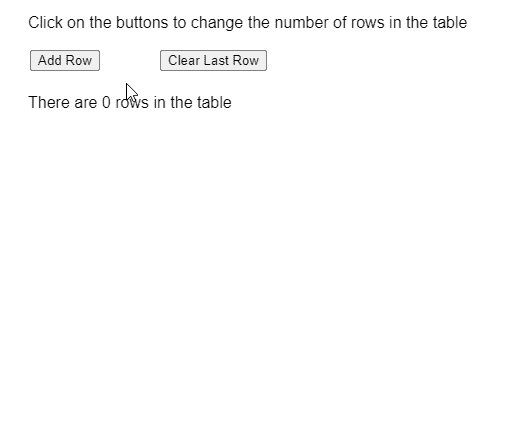

# p5。表 getRowCount()方法

> 原文:[https://www.geeksforgeeks.org/p5-table-getrowcount-method/](https://www.geeksforgeeks.org/p5-table-getrowcount-method/)

p5 的 **getRowCount()方法**。p5.js 中的 Table 用于返回 table 对象中的总行数。

**语法:**

```
getRowCount()
```

**参数:**此功能不接受任何参数。

**返回值:**返回一个指定表中行数的整数值。

下面的例子说明了 p5.js 中的 **getRowCount()方法**:

**示例:**

```
let rowCount = 1;

function setup() {
  createCanvas(500, 400);
  textSize(16);

  addRowBtn = createButton("Add Row");
  addRowBtn.position(30, 50);
  addRowBtn.mouseClicked(addOneRow);

  removeRowBtn =
    createButton("Clear Last Row");
  removeRowBtn.position(160, 50);
  removeRowBtn.mouseClicked(clearLastRow);

  // Create the table
  table = new p5.Table();

  // Add columns
  table.addColumn("book");
  table.addColumn("price");

  // Display the table
  showTable();
}

function addOneRow() {
  let newRow = table.addRow();
  newRow.set('book', "Book " + rowCount);
  newRow.set('price', "Price " +
    (rowCount * random(1, 10)).toFixed(1));

  rowCount++;

  showTable();
}

function clearLastRow() {
  let lastRow = table.getRowCount() - 1;
  if (lastRow >= 0) 
    table.removeRow(lastRow);

  showTable();
}

function showTable() {
  clear();
  text("Click on the buttons to change" +
       " the number of rows in the table",
       20, 20);

  // Get the number of rows in the table
  let rowCount = table.getRowCount();

  // Display the total rows
  // present in the table
  text("There are " + rowCount +
       " rows in the table", 20, 100);

  // Show all the rows currently
  // present in the table
  for (let r = 0; r < rowCount; r++) {
    let currRow = table.rows[r].arr.toString();
    currRow = currRow.split(", ").join("  ");

    text(currRow, 30, 140 + r * 20);
  }
}
```

**输出:**


**在线编辑:**[https://editor.p5js.org/](https://editor.p5js.org/)

**环境设置:**

**参考:**T2】https://p5js.org/reference/#/p5.Table/getRowCount