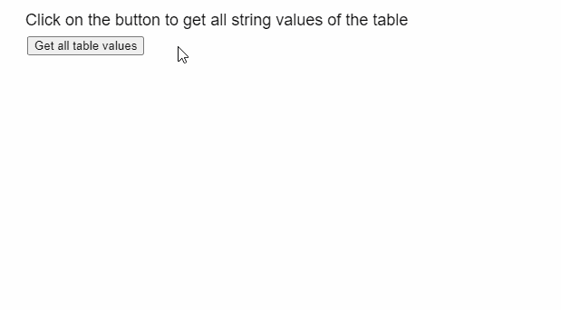
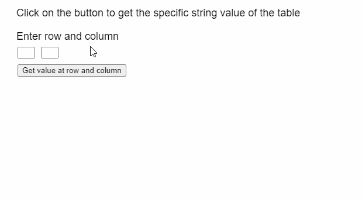

# p5。表 getString()方法

> 原文:[https://www.geeksforgeeks.org/p5-table-getstring-method/](https://www.geeksforgeeks.org/p5-table-getstring-method/)

p5 的 **getString()方法**。p5.js 中的表用于从表的给定行和列中检索 String 值。行可以由行标识指定，列可以由其列标识或列名指定。

**语法:**

```
getString( row, column )

```

**参数:**该方法接受两个参数，如上所述，如下所述:

*   **行:**是表示该行的行标识的数字。
*   **列:**是表示列名或列标识的字符串或数字。

**返回值:**该方法返回一个字符串，该字符串是从表的给定行和列中检索到的值。

下面的例子说明了 p5.js 中的 **getString()方法**:

**例 1:**

## java 描述语言

```
function setup() {
  createCanvas(600, 300);
  textSize(18);

  text("Click on the button to get all " +
  "string values of the table", 20, 20);

  setBtn =
    createButton("Get all table values");
  setBtn.position(30, 40);
  setBtn.mouseClicked(showTable);

  // Create the table
  table = new p5.Table();

  setTableData();
}

function setTableData() {
  table.addColumn('Waterfall');
  table.addColumn('Height');

  let tableRow = table.addRow();
  tableRow.setString('Waterfall',
                     'Angel Falls');
  tableRow.setString('Height',
                     '979 metres');

  tableRow = table.addRow();
  tableRow.setString('Waterfall', 'Tugela Falls');
  tableRow.setString('Height', '948 metres');

  tableRow = table.addRow();
  tableRow.setString('Waterfall', 'Tres Hermanas Falls');
  tableRow.setString('Height', '914 metres');
}

function showTable() {
  clear();
  text("The values of the table are retrieved " +
  "using the getString() method", 20, 20);

  // Show all the columns present
  for (let c = 0; c < table.getColumnCount(); c++) {
    text(table.columns, 20 + 200 * c, 80);
  }

  // Show all the rows currently
  // present in the table
  for (let r = 0; r < table.getRowCount(); r++) {
    for (let c = 0; c < table.getColumnCount(); c++) {

      // Get the string at the given row and column
      text(table.getString(r, c),
           20 + 200 * c,
           110 + 20 * r);
    }
  }
}
```

**输出:**



**例 2:**

## java 描述语言

```
function setup() {
  createCanvas(600, 300);
  textSize(18);

  text("Click on the button to get the " +
       "specific string value of the table",
       20, 20);

  text("Enter row and column", 20, 60);

  rowInp = createInput();
  rowInp.position(30, 80);
  rowInp.size(30, 20);

  colInp = createInput();
  colInp.position(70, 80);
  colInp.size(30, 20);

  setBtn =
    createButton("Get value at row and column");
  setBtn.position(30, 110);
  setBtn.mouseClicked(getValueAt);

  // Create the table
  table = new p5.Table();

  setTableData()
}

function setTableData() {

  table.addColumn('Waterfall');
  table.addColumn('Height');

  let tableRow = table.addRow();
  tableRow.setString('Waterfall', 'Angel Falls');
  tableRow.setString('Height', '979 metres');

  tableRow = table.addRow();
  tableRow.setString('Waterfall', 'Tugela Falls');
  tableRow.setString('Height', '948 metres');

  tableRow = table.addRow();
  tableRow.setString('Waterfall', 'Tres Hermanas Falls');
  tableRow.setString('Height', '914 metres');

}

function getValueAt() {
  clear();
  let rowToGet = int(rowInp.value());
  let colToGet = int(colInp.value());

  if (rowToGet < table.getRowCount() &&
      colToGet < table.getColumnCount()) {
    text("The value at row " + rowToGet +
         " and column " + colToGet + " is:",
         20, 160);

    // Get the string at the given row and column
    text(table.getString(rowToGet, colToGet),
         20, 180);
  }
  else
    text("Please enter correct row and " +
         "column values", 20, 160);

  text("Click on the button to get the " +
       "specific string value of the table",
       20, 20);
  text("Enter row and column", 20, 60);
}
```

**输出:**



**在线编辑:**[https://editor.p5js.org/](https://editor.p5js.org/)

**环境设置:**

**参考:**T2】https://p5js.org/reference/#/p5.Table/getString