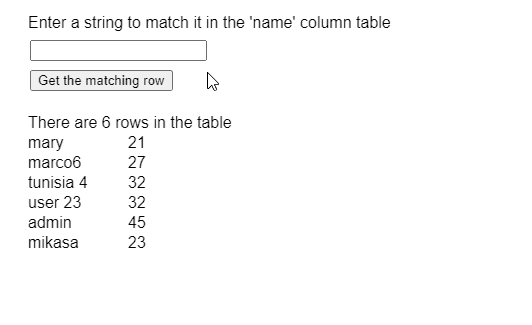

# p5。表匹配行()方法

> 原文:[https://www.geeksforgeeks.org/p5-table-matchrows-method/](https://www.geeksforgeeks.org/p5-table-matchrows-method/)

p5 的**匹配行()方法**。p5.js 中的表用于查找与给定正则表达式匹配的所有行。它以数组的形式返回对匹配行的引用。方法用来搜索行的列可以指定为参数。

**语法:**

```
matchRows( regexp, [column] )
```

**参数:**该方法接受两个参数，如上所述，如下所述:

*   **regexp:** 它是一个 String 或 regexp 对象，指定要匹配的正则表达式。
*   **列:**是表示列名或列标识的字符串或数字。这是一个可选参数。

**返回值:**这个方法返回一个 p5 的数组。匹配给定正则表达式的 TableRow 对象。

下面的例子说明了 p5.js 中的**匹配 row()方法**:

**示例:**

```
function setup() {
  createCanvas(500, 300);
  textSize(16);

  matchQueryInput =
    createInput();
  matchQueryInput.position(30, 40);

  getColBtn =
    createButton("Get the matching row");
  getColBtn.position(30, 70);
  getColBtn.mouseClicked(getMatchedResults);

  // Create the table
  table = new p5.Table();

  // Add two columns
  table.addColumn("name");
  table.addColumn("id");

  // Add some rows to the table
  let newRow = table.addRow();
  newRow.setString("name", "mary");
  newRow.setString("id", 21);

  newRow = table.addRow();
  newRow.setString("name", "marco6");
  newRow.setString("id", 27);

  newRow = table.addRow();
  newRow.setString("name", "tunisia 4");
  newRow.setString("id", 32);

  newRow = table.addRow();
  newRow.setString("name", "user 23");
  newRow.setString("id", 32);

  newRow = table.addRow();
  newRow.setString("name", "admin");
  newRow.setString("id", 45);

  newRow = table.addRow();
  newRow.setString("name", "mikasa");
  newRow.setString("id", 23);

  showTable();
}

function getMatchedResults() {
  clear();

  let matchQuery =
      matchQueryInput.value();

  if (matchQuery != "") {

    // Match the query in the column of 'name' 
    matchResults =
      table.matchRows(new RegExp(matchQuery),
                      'name');

    if (matchResults.length > 0) {
      text("The rows that matches the " +
           "query is", 20, 120);

      for (let i = 0; i < matchResults.length; i++) {
        // Display the matched value
        text(matchResults[i].arr[0], 20, 140 + i * 20);
        text(matchResults[i].arr[1], 120, 140 + i * 20);
      }

    }
    else text("No Results Found", 20, 120);

  } else {
    text("The query string is empty", 20, 120);
  }
  text("Enter a string to match it in " + 
       "the 'name' column table", 20, 20);
}

function showTable() {
  clear();

  // Display the total rows present in the table
  text("There are " + table.getRowCount() +
       " rows in the table", 20, 120);

  for (let r = 0; r < table.getRowCount(); r++)
    for (let c = 0; c < table.getColumnCount(); c++)
      text(table.getString(r, c),
           20 + c * 100, 140 + r * 20);

  text("Enter a string to match it in " + 
       "the 'name' column table", 20, 20);
}
```

**输出:**


**环境设置:**

**参考:**https://p5js.org/reference/#/p5.Table/matchRows