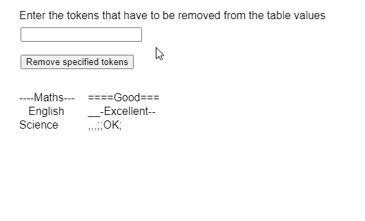
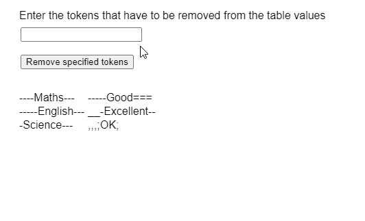

# p5。表格移除令牌()方法

> 原文:[https://www.geeksforgeeks.org/p5-table-removetokens-method/](https://www.geeksforgeeks.org/p5-table-removetokens-method/)

p5 的**remove token()方法**。p5.js 中的 Table 用于从表中的值中移除所有指定的字符。可以指定特定的列，以便仅从该列中移除令牌。但是，如果没有指定列，则处理表中所有列和行的值。

**语法:**

```
removeTokens( chars, [column] )
```

**参数:**该函数接受两个参数，如上所述，如下所述:

*   **字符:**它是一个字符串，指定必须删除的所有字符。
*   **列:**它是一个字符串或整数，指定要修剪的列的列名或列标识。这是一个可选参数。

下面的例子说明了 p5.js 中的**remove token()方法**。

**例 1:**

```
function setup() {
  createCanvas(500, 300);
  textSize(16);

  tokensInput = createInput();
  tokensInput.position(30, 40)

  trimBtn =
    createButton("Remove specified tokens");
  trimBtn.position(30, 80);
  trimBtn.mouseClicked(cleanTableData);

  // Create the table
  table = new p5.Table();

  // Add two columns
  table.addColumn("subject");
  table.addColumn("performance");

  // Add some rows to the table
  let newRow = table.addRow();
  newRow.setString("subject",
                   "----Maths---");
  newRow.setString("performance",
                   "====Good===");

  newRow = table.addRow();
  newRow.setString("subject",
                   "   English");
  newRow.setString("performance",
                   "__-Excellent--");

  newRow = table.addRow();
  newRow.setString("subject",
                   "Science");
  newRow.setString("performance",
                   ",,, ;;OK;");

  showTable();
}

function cleanTableData() {
  let tokensToRemove = tokensInput.value();

  // Remove given tokens only from the
  // whole table
  table.removeTokens(tokensToRemove);

  // Redraw the table
  showTable();
}

function showTable() {
  clear();

  // Display the rows present in the table
  for (let r = 0; r < table.getRowCount(); r++)
    for (let c = 0; c < table.getColumnCount(); c++)
      text(table.getString(r, c),
           20 + c * 100,
           140 + r * 20);

      text("Enter the tokens that have to be" +
           " removed from the table values", 
           20, 20);
}
```

**输出:**


**例 2:**

```
function setup() {
  createCanvas(500, 300);
  textSize(16);

  tokensInput = createInput();
  tokensInput.position(30, 40)

  trimBtn =
    createButton("Remove specified tokens");
  trimBtn.position(30, 80);
  trimBtn.mouseClicked(cleanTableData);

  // Create the table
  table = new p5.Table();

  // Add two columns
  table.addColumn("subject");
  table.addColumn("performance");

  // Add some rows to the table
  let newRow = table.addRow();
  newRow.setString("subject",
                   "----Maths---");
  newRow.setString("performance",
                   "-----Good===");

  newRow = table.addRow();
  newRow.setString("subject",
                   "-----English---");
  newRow.setString("performance",
                   "__-Excellent--");

  newRow = table.addRow();
  newRow.setString("subject",
                   "-Science---");
  newRow.setString("performance",
                   ",,, ;OK;");

  showTable();
}

function cleanTableData() {
  let tokensToRemove = tokensInput.value();

  // Remove given tokens only from the
  // 'name' column
  table.removeTokens(tokensToRemove,
                     'subject');

  // Redraw the table
  showTable();
}

function showTable() {
  clear();

  // Display the rows present in the table
  for (let r = 0; r < table.getRowCount(); r++)
    for (let c = 0; c < table.getColumnCount(); c++)
      text(table.getString(r, c),
           20 + c * 100,
           140 + r * 20);

      text("Enter the tokens that have to be" + 
           " removed from the table values",
           20, 20);
}
```

**输出:**


**在线编辑:**[https://editor.p5js.org/](https://editor.p5js.org/)

**环境设置:**

**参考:**T2】https://p5js.org/reference/#/p5.Table/removeTokens