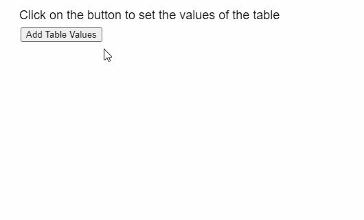
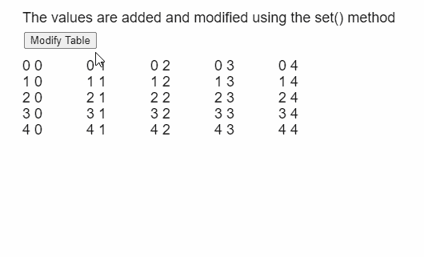

# p5。表组()方法

> 原文:[https://www.geeksforgeeks.org/p5-table-set-method/](https://www.geeksforgeeks.org/p5-table-set-method/)

p5 的**设置()方法**。p5.js 中的 Table 用于将给定值存储到表的给定行和列中。行可以由行标识指定，列可以由其列标识或名称指定。

**语法:**

```
set( row, column, value )
```

**参数:**该功能接受三个参数，如上所述，描述如下:

*   **行:**是表示该行的行标识的数字。
*   **列:**是表示列名或列标识的字符串或数字。
*   **值:**它是一个字符串或数字，指定必须存储的值。

下面的例子说明了 p5.js 中的 **set()方法**:

**例 1:**

```
function setup() {
  createCanvas(500, 300);
  textSize(18);

  text("Click on the button to set the" +
       " values of the table", 20, 20);

  setBtn = createButton("Add Table Values");
  setBtn.position(30, 40);
  setBtn.mouseClicked(setTableData);

  // Create the table
  table = new p5.Table();

  // Add 5 columns and rows to the table
  for (let i = 0; i < 5; i++) {
    table.addColumn("Column " + i);
    table.addRow();
  }
}

function setTableData() {
  for (let r = 0; r < 5; r++) {
    for (let c = 0; c < 5; c++) {

      // Set the value at the given
      // column and row of the table
      table.set(r, c, r + " " + c);
    }
  }

  showTable();
}

function showTable() {
  clear();
    text("Click on the button to set the" +
       " values of the table", 20, 20);

  // Show all the columns present
  for (let c = 0; c < 5; c++) {
    text(table.columns, 20 + 80 * c, 80);
  }

  // Show all the rows currently
  // present in the table
  for (let r = 0; r < 5; r++) {
    for (let c = 0; c < 5; c++) {
      text(table.getString(r, c),
           20 + 80 * c,
           100 + 20 * r);
    }
  }
}
```

**输出:**


**例 2:**

```
function setup() {
  createCanvas(500, 300);
  textSize(18);

  changeBtn =
    createButton("Modify Table");
  changeBtn.position(30, 40);
  changeBtn.mouseClicked(modifyTable);

  // Create the table
  table = new p5.Table();

  // Add 5 columns and rows to the table
  for (let i = 0; i < 5; i++) {
    table.addColumn("Column " + i);
    table.addRow();
  }

  setTableData();

  // Display the table
  showTable();
}

function setTableData() {
  for (let r = 0; r < 5; r++) {
    for (let c = 0; c < 5; c++) {

      // Set the value at the given
      // column and row of the table
      table.set(r, c, r + " " + c);
    }
  }

  showTable();
}

function modifyTable() {
  for (let r = 0; r < 5; r++) {
    for (let c = 0; c < 5; c++) {

      // If the index of the table is
      // a diagonal, set it to "XX"
      if (r == c) table.set(r, c, "XX");
    }
  }

  showTable();
}

function showTable() {
  clear();
   text("Click on the button to set the" +
       " values of the table", 20, 20);

  // Show all the rows currently
  // present in the table
  for (let r = 0; r < 5; r++) {
    for (let c = 0; c < 5; c++) {
      text(table.getString(r, c),
           20 + 80 * c,
           80 + 20 * r);
    }
  }
}
```

**输出:**


**在线编辑:**[https://editor.p5js.org/](https://editor.p5js.org/)

**环境设置:**

**参考:**T2】https://p5js.org/reference/#/p5.Table/set