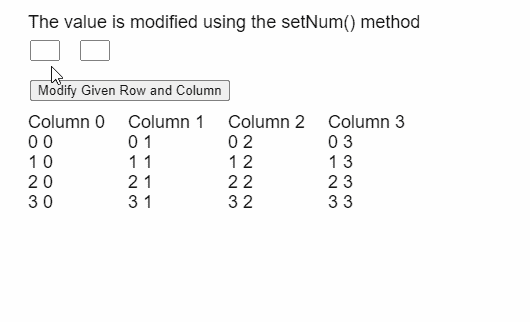

# p5。表 setNum()方法

> 原文:[https://www.geeksforgeeks.org/p5-table-setnum-method/](https://www.geeksforgeeks.org/p5-table-setnum-method/)

p5 的 **setNum()方法**。p5.js 中的表用于将给定的 Float 值存储到表的给定行和列中。行可以由行标识指定，列可以由其列标识或列名指定。

**语法:**

```
setNum( row, column, value )
```

**参数:**该功能接受三个参数，如上所述，描述如下:

*   **行:**是表示该行的行标识的数字。
*   **列:**是表示列名或列标识的字符串或数字。
*   **值:**它是一个指定必须存储的值的数字。

下面的例子说明了 p5.js 中的 **setNum()方法**:

**示例:**

```
function setup() {
  createCanvas(500, 300);
  textSize(18);

  text("Enter the index of the table" +
       " to be modified", 20, 20);

  rowInput = createInput();
  rowInput.size(30);
  rowInput.position(30, 40);

  colInput = createInput();
  colInput.size(30);
  colInput.position(80, 40);

  setBtn =
    createButton("Modify Given Row and Column");
  setBtn.position(30, 80);
  setBtn.mouseClicked(modifyTableData);

  // Create the table
  table = new p5.Table();

  // Add 5 columns and rows to the table
  for (let i = 0; i < 4; i++) {
    table.addColumn("Column " + i);
    table.addRow();
  }

  setTableData();
}

function modifyTableData() {

  givenRow = int(rowInput.value());
  givenCol = int(colInput.value());

  if (givenRow < table.getRowCount() && 
      givenCol < table.getColumnCount())

    // Set a number value to the given
    // row and column
    table.setNum(givenRow, givenCol, -999);

  showTable();
}

function setTableData() {
  for (let r = 0; r < 4; r++) {
    for (let c = 0; c < 4; c++) {

      // Set the value at the given
      // column and row of the table
      table.set(r, c, r + " " + c);
    }
  }

  showTable();
}

function showTable() {
  clear();
  text("The value is modified using" +
       " the setNum() method", 20, 20);

  // Show all the columns present
  for (let c = 0; c < 4; c++) {
    text(table.columns,
         20 + 100 * c, 120);
  }

  // Show all the rows currently
  // present in the table
  for (let r = 0; r < 4; r++) {
    for (let c = 0; c < 4; c++) {
      text(table.getString(r, c),
           20 + 100 * c,
           140 + 20 * r);
    }
  }
}
```

**输出:**


**在线编辑:**[https://editor.p5js.org/](https://editor.p5js.org/)

**环境设置:**

**参考:**T2】https://p5js.org/reference/#/p5.Table/setNum