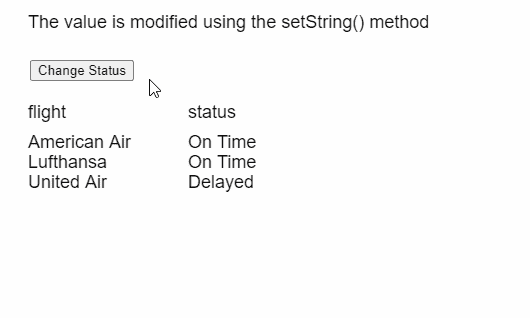
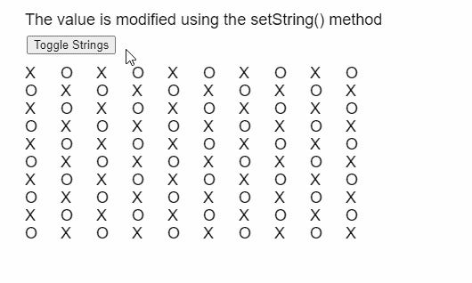

# p5。表设置字符串()方法

> 原文:[https://www.geeksforgeeks.org/p5-table-setstring-method/](https://www.geeksforgeeks.org/p5-table-setstring-method/)

p5 的 **setString()方法**。p5.js 中的表用于将给定的 String 值存储到表的给定行和列中。行可以由行标识指定，列可以由其列标识或列名指定。

**语法:**

```
setString( row, column, value )
```

**参数:**该功能接受三个参数，如上所述，描述如下:

*   **行:**是表示该行的行标识的数字。
*   **列:**是表示列名或列标识的字符串或数字。
*   **值:**是指定必须存储的值的字符串。

下面的例子说明了 p5.js 中的 **setString()方法**:

**例 1:**

```
function setup() {
  createCanvas(500, 300);
  textSize(18);

  text("Click the button to modify" +
       " the table", 20, 20);

  setBtn =
    createButton("Change Status");
  setBtn.position(30, 60);
  setBtn.mouseClicked(modifyTableData);

  // Create the table
  table = new p5.Table();

  // Add the columns and rows
  table.addColumn("flight");
  table.addColumn("status");

  let row = table.addRow();
  row.setString("flight", "American Air");
  row.setString("status", "On Time");

  row = table.addRow();
  row.setString("flight", "Lufthansa");
  row.setString("status", "On Time");

  row = table.addRow();
  row.setString("flight", "United Air");
  row.setString("status", "Delayed");

  showTable();
}

function modifyTableData() {

  // Loop through all the rows
  // in the table
  for (let r = 0; r < table.getRowCount(); r++) {

    // Change the string of the status column
    if (table.getString(r, "status") == "On Time") 
      table.setString(r, "status", "Delayed");
    else table.setString(r, "status", "On Time");
  }

  showTable();
}

function showTable() {
  clear();
  text("The value is modified using the" +
       " setString() method", 20, 20);

  // Show all the columns present
  for (let c = 0; c < 2; c++) {
    text(table.columns,
         20 + 160 * c, 110);
  }

  // Show all the rows currently
  // present in the table
  for (let r = 0; r < 3; r++) {
    for (let c = 0; c < 2; c++) {
      text(table.getString(r, c),
           20 + 160 * c,
           140 + 20 * r);
    }
  }
}
```

**输出:**


**例 2:**

```
function setup() {
  createCanvas(500, 300);
  textSize(18);

  setBtn = createButton("Toggle Strings");
  setBtn.position(30, 40);
  setBtn.mouseClicked(modifyTableData);

  // Create the table
  table = new p5.Table();

  for (let i = 0; i < 10; i++) {
    table.addColumn();
    table.addRow();
  }

  createTable();
}

function createTable() {

  // Loop through all the rows and columns
  // in the table and set their initial
  // string values
  for (let r = 0; r < table.getRowCount(); r++) {
    for (let c = 0; c < table.getColumnCount(); c++) {
      if ((r + c) % 2 == 0) 
        table.setString(r, c, "X");
      else table.setString(r, c, "O");
    }
  }

  showTable();
}

function modifyTableData() {

  // Loop through all the rows and columns
  // in the table and change their values
  // depending on the previous string
  for (let r = 0; r < table.getRowCount(); r++) {
    for (let c = 0; c < table.getColumnCount(); c++) {
      if (table.getString(r, c) == "X") 
        table.setString(r, c, "O");
      else table.setString(r, c, "X");
    }
  }

  showTable();
}

function showTable() {
  clear();
  text("The value is modified using the" + 
       " setString() method", 20, 20);

  // Show all the rows currently
  // present in the table
  for (let r = 0; r < table.getRowCount(); r++) {
    for (let c = 0; c < table.getColumnCount(); c++) {
      text(table.getString(r, c), 
           20 + 40 * c, 
           80 + 20 * r);
    }
  }
}
```

**输出:**


**在线编辑:**[https://editor.p5js.org/](https://editor.p5js.org/)

**环境设置:**

**参考:**T2】https://p5js.org/reference/#/p5.Table/setString