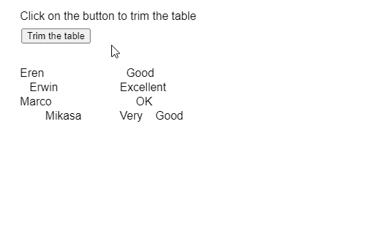
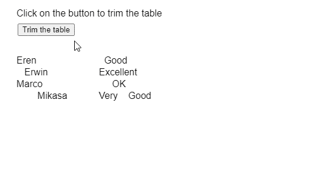

# p5。工作台修整()方法

> 原文:[https://www.geeksforgeeks.org/p5-table-trim-method/](https://www.geeksforgeeks.org/p5-table-trim-method/)

p5 的**修剪()方法**。p5.js 中的表用于从字符串形式的表值中删除前导空格和尾随空格。空格包括字符串中可能存在的空格或制表符。可以指定特定的列，仅用于从该列中删除空格。但是，如果没有指定列，则所有列和行中的值都将被修剪。

**语法:**

```
trim( [column] )
```

**参数:**该函数接受如上所述的单个参数，如下所述:

*   **列:**它是一个字符串或整数，指定要修剪的列的列名或列标识。这是一个可选参数。

下面的例子说明了 p5.js 中的**修剪()方法**:

**例 1:**

```
function setup() {
  createCanvas(500, 300);
  textSize(16);

  trimBtn =
    createButton("Trim the table");
  trimBtn.position(30, 40);
  trimBtn.mouseClicked(trimTable);

  // Create the table
  table = new p5.Table();

  // Add two columns
  table.addColumn("name");
  table.addColumn("rating");

  // Add some rows to the table
  let newRow = table.addRow();
  newRow.setString("name", "Eren      ");
  newRow.setString("rating", "  Good");

  newRow = table.addRow();
  newRow.setString("name", "   Erwin");
  newRow.setString("rating", "Excellent     ");

  newRow = table.addRow();
  newRow.setString("name", "Marco");
  newRow.setString("rating", "     OK");

  newRow = table.addRow();
  newRow.setString("name", "        Mikasa        ");
  newRow.setString("rating", "Very    Good  ");

  showTable();
}

function trimTable() {
  // Trim all the columns and rows
  table.trim();

  // Redraw the table
  showTable();
}

function showTable() {
  clear();

  // Display the rows present in the table
  for (let r = 0; r < table.getRowCount(); r++)
    for (let c = 0; c < table.getColumnCount(); c++)
      text(table.getString(r, c),
           20 + c * 140,
           100 + r * 20);

  text("Click on the button to trim the table",
       20, 20);
}
```

**输出:**


**例 2:**

```
function setup() {
  createCanvas(500, 300);
  textSize(16);

  trimBtn = 
    createButton("Trim the table");
  trimBtn.position(30, 40);
  trimBtn.mouseClicked(trimTable);

  // Create the table
  table = new p5.Table();

  // Add two columns
  table.addColumn("name");
  table.addColumn("rating");

  // Add some rows to the table
  let newRow = table.addRow();
  newRow.setString("name", "Eren      ");
  newRow.setString("rating", "  Good");

  newRow = table.addRow();
  newRow.setString("name", "   Erwin");
  newRow.setString("rating", "Excellent     ");

  newRow = table.addRow();
  newRow.setString("name", "Marco");
  newRow.setString("rating", "     OK");

  newRow = table.addRow();
  newRow.setString("name", "        Mikasa        ");
  newRow.setString("rating", "Very    Good  ");

  showTable();
}

function trimTable() {
  // Trim only the 'name' column
  table.trim('name');

  // Redraw the table
  showTable();
}

function showTable() {
  clear();

  // Display the rows present in the table
  for (let r = 0; r < table.getRowCount(); r++)
    for (let c = 0; c < table.getColumnCount(); c++)
      text(table.getString(r, c),
           20 + c * 140, 100 + r * 20);

  text("Click on the button to trim the table",
       20, 20);
}
```

**输出:**


**在线编辑:**[https://editor.p5js.org/](https://editor.p5js.org/)

**环境设置:**

**参考:**T2】https://p5js.org/reference/#/p5.Table/trim