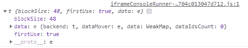
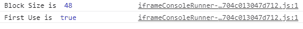

# tensorflow . js . TF .后端()函数

> 原文:[https://www . geesforgeks . org/tensorflow-js-TF-后端-function/](https://www.geeksforgeeks.org/tensorflow-js-tf-backend-function/)

**Tensorflow.js** 是谷歌开发的开源库，用于在浏览器或节点环境中运行机器学习模型和深度学习神经网络。它还帮助开发人员用 JavaScript 语言开发 ML 模型，并且可以直接在浏览器或 Node.js 中使用 ML。

**tf .后端()功能**用于获取当前浏览器的当前后端。

**语法:**

```
tf.backend()
```

**参数:**不接受任何参数。

**返回值:**返回内核包。

**例 1:**

## java 描述语言

```
// Setting the backend
tf.setBackend("cpu")

// Getting the backend using
// backend method
console.log(tf.backend())
```

**输出:**



**例 2:**

## java 描述语言

```
// Setting the backend
tf.setBackend("cpu")

// Getting the backend using
// backend method
console.log("Block Size is ",tf.backend().blockSize)
console.log("First Use is ",tf.backend().firstUse)
```

**输出:**



**参考:**[https://js.tensorflow.org/api/latest/#Backends](https://js.tensorflow.org/api/latest/#Backends)