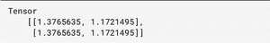
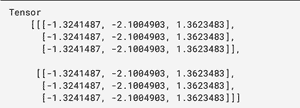
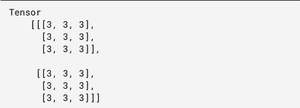
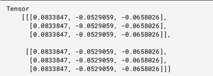

# tensorflow . js TF . layers . dense()函数

> 原文:[https://www . geesforgeks . org/tensorflow-js-TF-layers-dense-function/](https://www.geeksforgeeks.org/tensorflow-js-tf-layers-dense-function/)

tf.layers.dense()是 Tensorflow.js 库的一个内置函数。该函数用于创建完全连接的层，其中每个输出都依赖于每个输入。

**语法:**

```
tf.layers.dense(args)
```

**参数:**该函数将*参数*对象作为参数，该参数可以具有以下属性:

*   **单位:**定义输出空间维度的正数。
*   **激活**:指定使用哪个激活功能。
*   **使用偏置:**指定是否应用偏置。
*   **内核初始化器:**指定哪个初始化器用于密集内核权重矩阵**。**
*   **偏置化器:**指定该层的偏置向量。
*   **输入图形:**将输入图形定义为[输入图形]。
*   **内核约束:**指定内核的约束。
*   **偏置约束:**偏置向量的具体约束。
*   **核正则化器:**指定应用于稠密核权重矩阵的正则化器函数。
*   **偏置正则化器:**指定应用于偏置向量的正则化函数。
*   **激活正则化器:**指定应用于激活的正则化函数。
*   **输入形状:**如果定义了该参数，它将创建另一个输入层插入到该层之前。
*   **batchInputShape:** 如果定义了这个参数，它会创建另一个输入图层，插入到这个图层之前。
*   **batchSize :** 用于构造 batchInputShape，如果尚未指定。
*   **数据类型:**指定该图层的数据类型。此参数的默认值为“float32”。
*   **名称:**指定该图层的名称。
*   **可训练:**指定是否通过拟合更新该层的权重。
*   **权重:**指定图层的初始权重值。
*   **输入类型**:用于表示输入类型，其值可以是“float32”或“int32”或“bool”或“complex64”或“string”。

**返回值:**返回密集对象。

**例 1:**

## java 描述语言

```
import * as tf from "@tensorflow/tfjs"

// Create a new dense layer
const denseLayer = tf.layers.dense({
   units: 2,
   kernelInitializer: 'heNormal',
   useBias: true
});

const input = tf.ones([2, 3]);
const output = denseLayer.apply(input);

// Print the output
output.print()
```

**输出:**



**例 2:**

## java 描述语言

```
import * as tf from "@tensorflow/tfjs"

// Create a new dense layer
const denseLayer = tf.layers.dense({
   units: 3,
   kernelInitializer: 'heNormal',
   useBias: false
});

const input = tf.ones([2, 3, 3]);
const output = denseLayer.apply(input);

// Print the output
output.print()
```

**输出:**



**例 3:**

## java 描述语言

```
import * as tf from "@tensorflow/tfjs"

// Create a new dense layer
const denseLayer = tf.layers.dense({
   units: 3,
   kernelInitializer: 'ones',
   useBias: false
});

const input = tf.ones([2, 3, 3]);
const output = denseLayer.apply(input);

// Print the output
output.print()
```

**输出:**



**例 4:**

## java 描述语言

```
import * as tf from "@tensorflow/tfjs"

// Create a new dense layer
const denseLayer = tf.layers.dense({
   units: 3,
   kernelInitializer: 'randomUniform',
   useBias: false
});

const input = tf.ones([2, 3, 3]);
const output = denseLayer.apply(input);

// Print the output
output.print()
```

**输出:**



**参考:**T2】https://js.tensorflow.org/api/latest/#layers.dense