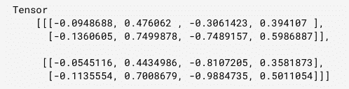

# Tensorflow.js tf.layers.gru()函数

> 原文:[https://www . geesforgeks . org/tensorflow-js-TF-layers-gru-function/](https://www.geeksforgeeks.org/tensorflow-js-tf-layers-gru-function/)

Tensorflow.js 是谷歌开发的开源库，用于在浏览器或节点环境中运行机器学习模型和深度学习神经网络。

Tensorflow.js **tf.layers.gru()函数**用于创建仅由一个 GRUCell 组成的 RNN 层，该层的应用方法对一系列输入 tensor**进行操作。**输入张量的形状必须至少是 2D，第一维必须是时间步长**。gru** 是门控轮回单位。

**语法:**

```
tf.layers.gru(args)
```

**参数:**

*   **参数:**指定给定的配置对象。
    1.  **重复激活:**指定将用于重复步骤的激活功能。该参数的默认值为硬 sigmoid。
    2.  **实现:**指定实现方式。它可以是 1 或 2。为了获得卓越的性能，建议实施。

**返回值:**返回一个图层

**例 1:**

## java 描述语言

```
// Importing the tensorflow.js library 
const tf = require("@tensorflow/tfjs"); 

// Create a RNN model with gru Layer
const RNN = tf.layers.gru({units: 8, returnSequences: true});

// Create an input which will have 5 time steps
const input = tf.input({shape: [5, 10]});
const output = RNN.apply(input);

console.log(JSON.stringify(output.shape));
```

**输出:**

```
[null, 5, 8]
```

**例 2:**

## java 描述语言

```
// Importing the tensorflow.js library 
const tf = require("@tensorflow/tfjs"); 

// Create a new model with gru Layer
const rnn = tf.layers.gru({units: 4, returnSequences: true});

// Create a 3d tensor
const x = tf.tensor3d([
    [
        [1, 2],
        [3, 4],
    ],
    [
        [5, 6],
        [7, 8],
    ],
]);

// Apply gru layer to x
const output = rnn.apply(x);

// Print output
output.print()
```

**输出:**



**参考资料:**[https://js . tensorlow . org/API/1 . 0 . 0/# layers . gru](https://js.tensorflow.org/api/1.0.0/#layers.gru)