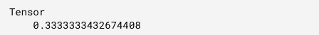

# tensorflow . js TF . loss . absolute difference()函数

> 原文:[https://www . geesforgeks . org/tensorflow-js-TF-loss-absolute difference-function/](https://www.geeksforgeeks.org/tensorflow-js-tf-losses-absolutedifference-function/)

**Tensorflow.js** 是谷歌开发的开源库，用于在浏览器或节点环境下运行机器学习模型和深度学习神经网络。它还帮助开发人员用 JavaScript 语言开发 ML 模型，并且可以直接在浏览器或 Node.js 中使用 ML。

tensorflow . js**TF . loss . absolute difference()**函数计算两个给定张量之间的绝对差值损失。

**语法:**

```
tf.losses.absoluteDifference(labels, 
    predictions, weights, reduction); 
```

**参数:**

*   **标签:**指定真值输出张量。基于这个张量预测绝对差。
*   **预测:**指定预测输出张量，维度与标签相同。
*   **权重:**它指定等级张量等于标签的等级张量，因此它可以是可展宽的或 0。这是一个可选参数。
*   **减少:**规定了减少损失的类型。它是可选的。

**返回值:**返回一个 tf。由**绝对差异()**函数计算的张量。

**示例 1:** 在本例中，我们将采用两个 2d 张量作为标签和预测。那么我们就会发现这两者的绝对差损。

## java 描述语言

```
// Importing the tensorflow.js library 
const tf = require("@tensorflow/tfjs"); 

// Defining label tensor 
const y_true = tf.tensor2d([ 
    [0., 1., 0.],  
    [0., 0., 0.] 
]); 

// Defining prediction tensor 
const y_pred = tf.tensor2d([ 
    [1., 1., 0.],  
    [1., 0., 0 ] 
]); 

// Calculating absolute difference 
const absolute_difference = 
    tf.losses.absoluteDifference(y_true,y_pred) 

// Printing the output 
 absolute_difference.print()
```

**输出:**



**例 2:** 取绝对函数中等级作为标签的权重，然后计算绝对差。

## java 描述语言

```
// Importing the tensorflow.js library 
const tf = require("@tensorflow/tfjs"); 

// Defining label tensor 
const y_true = tf.tensor2d( 
    [0., 1., 0., 0., 0., 0., 1.,  
    0., 1., 1., 0., 1.], [4, 3] 
); 
// Defining predicted tensor 
const y_pred = tf.tensor2d( 
    [1., 1., 0., 1., 0., 0., 1.,  
    1., 1., 0., 0., 1.], [4, 3] 
); 

// Calculating absolute difference
const absolute_difference = tf.losses.absoluteDifference( 
       y_true, y_pred, [0.7, 0.3, 0.2]) 
absolute_difference.print()
```

**输出:**


**参考:**[https://js . tensorflow . org/API/1 . 0 . 0/# loss . absolute difference](https://js.tensorflow.org/api/1.0.0/#losses.absoluteDifference)