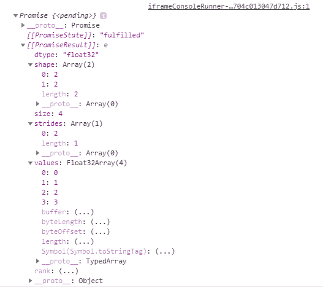
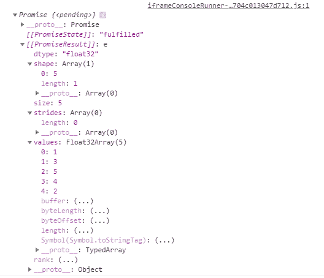

# Tensorflow.js tf。张量类。缓冲()方法

> 原文:[https://www . geesforgeks . org/tensorflow-js-TF-tensor-class-buffer-method/](https://www.geeksforgeeks.org/tensorflow-js-tf-tensor-class-buffer-method/)

**Tensorflow.js** 是谷歌开发的开源库，用于在浏览器或节点环境下运行机器学习模型和深度学习神经网络。它还帮助开发人员用 JavaScript 语言开发 ML 模型，并且可以直接在浏览器或 Node.js 中使用 ML。

**tf。Tensor class.buffer()** 方法用于返回 tf 的一个承诺。保存底层数据的 TensorBuffer。

**语法:**

```
buffer()
```

**参数:**不接受任何参数。

**返回值:**返回承诺< tf。TensorBuffer >。

**示例 1:** 创建二维张量。

## java 描述语言

```
const a= tf.tensor2d([[0, 1], [2, 3]])

console.log(a.buffer())
```

**输出:**



**例 2:**

## java 描述语言

```
const a= tf.tensor([1, 3, 5, 4, 2])

console.log(a.buffer())
```

**输出:**



**参考:**T2**https://js.tensorflow.org/api/latest/#tf.Tensor.buffer**T5】