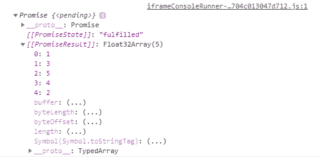
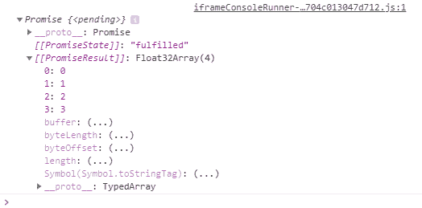

# Tensorflow.js tf。张量类。数据()方法

> 原文:[https://www . geesforgeks . org/tensorflow-js-TF-tensor-class-data-method/](https://www.geeksforgeeks.org/tensorflow-js-tf-tensor-class-data-method/)

**Tensorflow.js** 是谷歌开发的开源库，用于在浏览器或节点环境下运行机器学习模型和深度学习神经网络。它还帮助开发人员用 JavaScript 语言开发 ML 模型，并且可以直接在浏览器或 Node.js 中使用 ML。

**tf。张量类。data()** 方法用于从 tf.Tensor 异步下载值。

**语法:**

```
data()
```

**参数:**不接受任何参数。

**返回值:**返回承诺<数据类型映射【数字数据类型】>。

**例 1:**

## java 描述语言

```
const a = tf.tensor([1, 3, 5, 4, 2])
console.log(a.data())
```

**输出:**



**示例 2:** 创建二维张量

## java 描述语言

```
const a = tf.tensor2d([[0, 1], [2, 3]])
console.log(a.data())
```

**输出:**



**参考:**T2】https://js.tensorflow.org/api/latest/#tf.Tensor.data