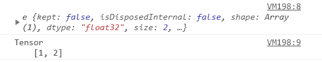

# Tensorflow.js tf。张量。toString()方法

> 原文:[https://www . geesforgeks . org/tensorflow-js-TF-tensor-tostring-method/](https://www.geeksforgeeks.org/tensorflow-js-tf-tensor-tostring-method/)

Tensorflow.js 是谷歌开发的开源库，用于在浏览器或节点环境中运行机器学习模型和深度学习神经网络。

**tf.tensor.toString()** 方法用于以人类可读的形式记录张量如果您 console.log()只是 tf.tensor，那么它将记录整个张量对象，但是在使用。 **toString()** 方法它将记录张量的值。

#### 语法:

```
tf.tensor.toString(verbose?)
```

**参数:**该功能接受单个参数，如下图所示:

*   **详细:**布尔值。如果是**真**，那么张量的细节(**数据类型、等级、形状、值**)将被返回，否则将只返回张量值。虽然这是一个可选参数，默认为**假。**

**返回值:**以字符串形式返回张量值或张量的细节(数据类型、秩、形状、值)。

**示例 1:** 在此示例中，我们正在记录应用 **toString()** 方法前后的张量值。

## java 描述语言

```
// Importing the tensorflow.js library
import * as tf from "@tensorflow/tfjs"

// Creating the tensor
var val1 = tf.tensor([1, 2]);

// Applying the toString() method
var val2 = val1.toString()

// logging the tensor
console.log(val1)
console.log(val2)
```

**输出:**



**示例 2:** 在此示例中，我们应用了 **toString(** )方法中的布尔参数，并查看结果。

## java 描述语言

```
// Importing the tensorflow.js library
import * as tf from "@tensorflow/tfjs"

// Creating the tensor
var val = tf.tensor([1, 2]);

// Applying the toString() method
var val1 = val.toString(true)
var val2 = val.toString(false)
// logging the tensor
console.log(val1)
console.log(val2)
```

**输出:**

```
Tensor
  dtype: float32
  rank: 1
  shape: [2]
  values:
    [1, 2]
  Tensor
    [1, 2]
```