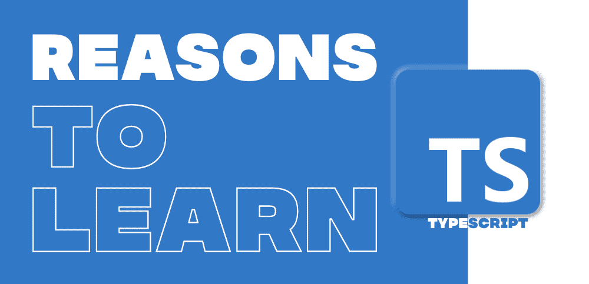

# 2020 年学习打字稿的 5 个理由

> 原文:[https://www . geesforgeks . org/5-学习原因-2020 年类型脚本/](https://www.geeksforgeeks.org/5-reasons-to-learn-typescript-in-2020/)

从最基本的开始，Typescript 是微软的开源项目，可以称为 [**JavaScript**](https://www.geeksforgeeks.org/javascript-tutorial/) 的超集。所以，在疫情冠状病毒引发经济危机的时候，开发者之间的竞争越来越激烈，现在每个计算机科学专业的学生都在做开发。如果你考虑以下几点，它将有助于你在发展中建立职业生涯，以及为什么 TypeScript 会给你的职业生涯带来优势。当我们通常选择任何新的语言或技术时，我们会考虑许多点，比如它的灵活性，它有多有用？它的未来会怎样？等等。本文将解决您所有与 TypeScript 相关的查询，而不是只呈现故事的一面或篡改的事实。

### 1.TypeScript 和 JavaScript

首先，让我们打破大多数初学者都有的一个误区。为什么 JavaScript 会消亡？还是 TypeScript 会超越 JavaScript 的范围？这些问题的答案是直截了当和简单的，类型脚本是 JavaScript 的语法超集，即每个 JavaScript 项目在类型脚本中都是完全有效的，这意味着 JavaScript 和类型脚本可以被认为是同一枚硬币的两面。了解你将采用的研究和技术确实很好，但最重要的部分是研究完整的事实，而不是相信神话。

当你开始使用 Typescript 进行开发时，大多数人都会问**如果** **这个 JavaScript** **的代码库是** **还是** **功能性的** **在** **Typescript** **那么** **为什么** **要做** **我们** **需要在 Typescript 中编码？**

好吧，大多数公司使用 TypeScript 的基本事实是，您可以理解在 javascript 中可能面临的未来挑战，但是要应对这些挑战，您需要使用 Typescript。正如我们所知，Typescript 是健壮的，也称为带有类型的 javascript，这意味着 JavaScript 不包括类型。如果你用 javascript 编写代码，那么除非你的代码被编译，否则你不会处理错误，这确实会影响代码的效率，因为 JavaScript 有一个非常庞大的库。所以很难不出错。在同样使用 TypeScript 时，您不能出错，如果您这样做了，您将会立即得到通知，这有助于您顺利处理编码工作。你可以专注于逻辑和设计部分。这使得构建大型项目变得不那么复杂，这也是为什么 TypeScript 被全球接受的主要原因之一。这是你在决定你真正想去哪里时应该记住的要点。

### 2.打字稿的未来

今天，我们生活在科技时代，当今世界的事物瞬息万变。大多数 javascript 程序员和开发人员在 Typescript 氛围中感到舒适，他们更喜欢 Typescript 而不是 JavaScript。所以你可以期待在未来几年。使用 JavaScript 的开发人员可能会转向 Typescript。如果你分析那些求助于 Typescript 开发人员的 JavaScript 开发人员的数据，那么图像对你来说会更加清晰。TypeScript 比其他脚本语言(如 CoffeeScript)更好。所以在学习了 JavaScript 之后，如果你进入了 Typescript 的世界，那么最好早点开始使用 Typescript，这确实对你未来有很大的帮助。

### 3.成长中的社区

自从 Typescript 被引入以来，它就随着时间的推移而越来越受欢迎。如果我们看看过去几年，它的流行曲线真的很棒。正如我们所知，微软正在为不断增长的社区类型脚本做出许多努力。除了这个 TechGiant， **ANGULAR 也在使用 Typescript。** Typescript 是为创建像现代网络这样的大型复杂系统而制作的。

流行背后的另一个主要原因是，当您与 Vue、Angular 和 React 一起工作时，Typescript 感觉非常棒。许多像 Redux、Style、Components、React intl、formik 这样的库都受 Typescript 的支持，这使得 Typescript 成为更大社区的选择。因此，您可以简单地得出结论，Typescript 的魔力正在世界各地发挥作用。顺其自然，感受氛围。许多开发人员认为，他们更喜欢 javascript 的唯一原因是，如果您正在处理 Typescript，就不能处理 React、Angular 和 Vue。Typescript 支持所有这些，因此您不必担心这一点。

### 4.工业中的支配地位

谷歌、脸书、微软以及更多的大公司都在开发 TypeScript。所以这真的让你非常兴奋，因为你正在从事具有全球范围的技术项目。你可能会想，使用全球通用的技术有什么好处？好吧，所以如果你想长远，那么在未来你可能会从事一些研究项目，或者你可能会走向创业，所以当你进入这些领域，那么你可能会面临许多挑战或困难，同时实现你的想法或顺利运行它，所以如果你在一项全球使用的技术中工作，那么你会发现一个大的社区可以帮助你，你不会发现自己被你的代码库和问题所困扰。所有这些对开发者来说都很重要。TypeScript 是继 C、C++、Java 和 Python 之后谷歌的主要语言之一。使用 TypeScript 的初创公司还有很多。

### 5.无可匹敌的打字稿

谷歌、脸书、微软等许多公司的开发人员广泛使用 TypeScript。除了这些巨头之外，许多初创公司也在开发 TypeScript。TypeScript 有许多技术特性，其中一些如下…

*   **面向对象编程:** TypeScript 提供了面向对象编程的所有功能，您可以在其中形成对象，因为 TypeScript 为类、接口和 OOP 的更多功能提供了内置支持。它有助于用干净和可伸缩的代码来设计和实现它们。TypeScript 的这一特性将它与其他特性分开，并使代码更具可读性，这有助于轻松维护和更改代码。

*   **JavaScript 库:** Typescript 支持所有的 JavaScript 库，您只需更改文件的扩展名，就可以将现有的 JavaScript 项目更改为 Typescript。您可以使用 Typescript 以及 React、Vue 和 Angular。Typescript 是 JavaScript 的超集，即 Typescript 包括 ES5 版本的 JavaScript 和 ES6 版本的 JavaScript 以及接口、泛型、类和许多其他特性。

*   **静态类型:** Typescript 将健壮的代码带到另一个级别来编写脚本，这有助于编写和维护更大的代码，尤其是在脚本编写的情况下，这有助于分析代码。您不必等到运行时才发现代码中的错误，这减少了设计的复杂性。它促进了可靠的重构，并使其更快。

*   **依赖注入:** Typescript 允许您在类外创建对象，并以许多不同的方式将这些对象提供给类。Typescript 有助于创建和绑定类外需要它们的依赖对象。这对测试很有帮助。

*   **其他特性:** Typescript 将代码编译成 JavaScript 版本，这有助于代码在所有浏览器上运行。TypeScript 还具有 Intellisense，这对于给出代码提示非常有帮助。它支持封装、抽象、多态和其他面向对象特性。Typescript 代码更易读、更干净、更可扩展。Typescript 是一种强类型语言，支持原型、动态类型和构造函数。此外，它有助于使用应用编程接口更改文档。该模块是 Typescript 的另一个惊人的特性，就像名称空间一样。

现在你可以更容易地做决定了。如果你仍然感到困惑，那么我们建议你选择在谷歌、脸书和微软工作的开发人员。