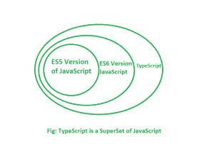

# 【TypeScript 和 JavaScript 的区别

> 原文:[https://www . geesforgeks . org/type-script 和-javascript 的区别/](https://www.geeksforgeeks.org/difference-between-typescript-and-javascript/)

**先决条件:** [JavaScript、](https://www.geeksforgeeks.org/how-to-be-a-javascript-developer-without-knowing-javascript/) [排版脚本](https://www.geeksforgeeks.org/hello-world-in-typescript-language/)

**为什么 TypeScript 是在有 JavaScript 的同时开发的？**
JavaScript 开发时，JavaScript 开发团队引入了 JavaScript 作为客户端编程语言。但是当人们使用 JavaScript 时，开发人员开始知道 JavaScript 也可以用作服务器端编程语言。但是当 JavaScript 不断发展的时候，JavaScript 的代码变得复杂和繁重。正因为如此，JavaScript 甚至不能完全满足面向对象编程语言的要求。这阻碍了 JavaScript 作为服务器端技术在企业级的成功。然后开发团队开发了**类型脚本**来弥补这个差距。

**打字稿的特点:**

*   **TypeScript 代码转换为普通 JavaScript 代码:**:浏览器无法理解 TypeScript 代码。这就是为什么如果代码是用 TypeScript 编写的，那么它会被编译并转换代码，即把代码翻译成 JavaScript。上述过程称为**转运**。在 JavaScript 代码的帮助下，浏览器能够读取代码并显示出来。
*   **JavaScript 是 TypeScript** :用 JavaScript 编写的任何代码都可以通过从**更改扩展名来转换为 TypeScript。js** 到**。ts** 。
*   **在任何地方使用 TypeScript:**TypeScript 代码可以在任何浏览器、设备或任何操作系统上运行。类型脚本不特定于任何虚拟机等。
*   **TypeScript 支持 JS 库:**通过 TypeScript，开发人员可以使用现有的 JavaScript 代码，合并流行的 JavaScript 库，并且可以从其他 JavaScript 代码中调用。

【TypeScript 和 JavaScript 的区别:

*   TypeScript 是一种面向对象的编程语言，而 JavaScript 是一种脚本语言。
*   TypeScript 有一个被称为静态类型的特性，但是 JavaScript 没有这个特性。
*   TypeScript 支持模块，而 JavaScript 不支持模块。
*   类型脚本有接口，但 JavaScript 没有接口。

**使用 TypeScript 相对于 JavaScript 的优势**

*   TypeScript 总是只在开发时指出编译错误。正因为如此，在运行时，出错的几率非常小，而 JavaScript 是一种解释语言。
*   TypeScript 具有强类型或支持静态类型的功能。这意味着静态类型允许在编译时检查类型正确性。这在 JavaScript 中是不可用的。
*   TypeScript 只不过是 JavaScript 和一些附加特性，即 ES6 特性。您的目标浏览器可能不支持它，但是 TypeScript 编译器可以编译**。ts** 文件也进入 ES3、ES4 和 ES5。

**使用 TypeScript 相对于 JavaScript 的缺点**

*   通常，TypeScript 编译代码需要时间。

JavaScript 最出名的是网页开发，但它也用于各种非浏览器环境。您可以通过以下 [JavaScript 教程](https://www.geeksforgeeks.org/javascript-tutorial/)和 [JavaScript 示例](https://www.geeksforgeeks.org/javascript-examples/)从头开始学习 JavaScript。