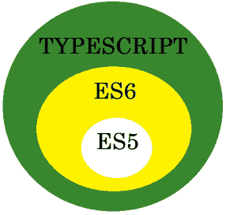

# 打字稿中的 Hello World

> 原文:[https://www . geesforgeks . org/hello-world-in-typescript-language/](https://www.geeksforgeeks.org/hello-world-in-typescript-language/)

TypeScript 是一种开源编程语言。它由微软开发和维护。TypeScript 在语法上遵循 javascript，但增加了更多功能。它是 javascript 的**超集**。
下图描述了关系:



Typescript 是纯面向对象的，具有类、对象和接口等特性，就像 Java 一样。以前对于 javascript 变量和对象，我们不需要提及它们的数据类型，这使得整体逻辑难以理解，因为我们不知道我们处理的是什么类型的数据。Typescript 修复了这个问题，并为开发人员提供了一种声明变量和对象的数据类型的方法。【typescript 提供的一些内置类型有:

1.  **数字:**整数和分数的 64 位双精度数字。
2.  **字符串:**字符序列或字符串类型数据。
3.  **void :** 用于不返回任何内容的函数。
4.  **空:**表示无值或空值
5.  **布尔值:**表示真或假的布尔值

**定义变量的语法:**

```
var variable_name : type;
```

示例:

## java 描述语言

```
// declares a string type variable called name.
var name: string;

// declares a number type variable called amount.
var amount: number;

// declares a boolean type variable called check;
var checked: boolean;

// declares a string type variable called first_name and
// initializes with some value.
var first_name: string = "geeksforgeeks";

// declares an array of numbers called digits.
var digits: number[];
```

**定义类、对象和函数的语法:**

```
class Class_Name{
 // instance variables

 // constructor
 // Typescript allows only one constructor per class
 constructor(parameters){
 }

 // methods
}

var object_name:class_name;

function_name(): returntype{
// function_body
}
```

**例:**

## java 描述语言

```
class Name {
    first_name: string;
    last_name: string;

    constructor(fname: string, lname: string)
    {
        first_name = fname;
        last_name = lname;
    }
    getName(): string
    {
        var fullname: string = first_name + last_name;
        return fullname;
    }
}

var author_name: Name;
```

**运行类型脚本代码**

浏览器本身并不理解 typescript，但它们理解 javascript。所以为了运行 typescript 代码，首先它被编译成 javascript。
**tsc :** 是一个将 typescript 代码转换成 javascript 的 typescript 编译器(transpiler)。
您可以通过运行以下命令来安装 TSC:

```
npm install -g typescript
```

**创建一个基本的打字脚本代码，打印“极客对极客的问候”:**

## java 描述语言

```
var greet: string = "Greetings";
var geeks: string = "Geeks For Geeks";
console.log(greet + " from " + geeks);
// save the file as hello.ts
```

1.  To compile typescript code we can run the following command on the command line.

    ```
    tsc hello.ts
    ```

    这个命令将生成一个名为 hello.js 的 javascript 文件

2.  在命令行上使用以下命令运行 javascript 文件:

    ```
    node hello.js
    ```

**您应该会在命令行上看到如下输出:**

```
Greetings from Geeks For Geeks
```

**打字脚本语言的应用:**

*   Angular 2+版本是用 typescript 编写的，并且使用 typescript，这证明了它在工业应用中的效率。
*   Typescript 使编译时错误诊断变得容易。
*   Typescript 是可扩展的，并且很好地支持大型应用程序。

**参考文献**T2【1】。[http://www.typescriptlang.org/](http://www.typescriptlang.org/)T5【2】。[http://www.typescriptlang.org/docs/index.html](http://www.typescriptlang.org/docs/index.html)T8】