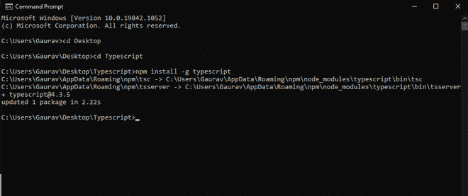
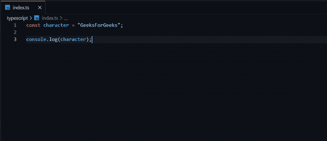
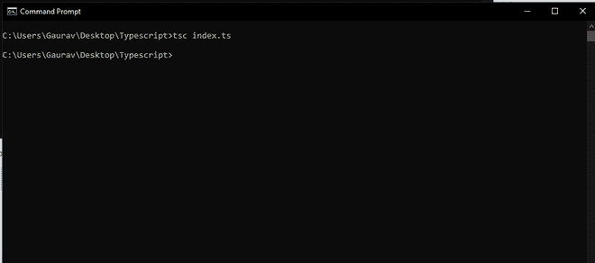
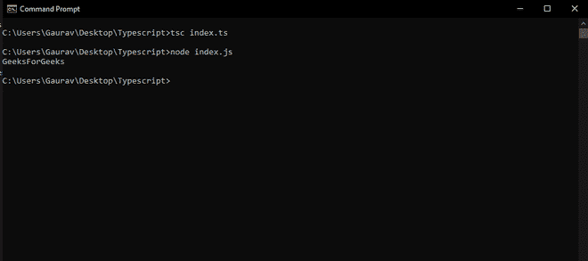

# 如何编译一个 Typescript 文件？

> 原文:[https://www . geesforgeks . org/如何编译一个类型脚本文件/](https://www.geeksforgeeks.org/how-to-compile-a-typescript-file/)

[**TypeScript**](https://www.geeksforgeeks.org/hello-world-in-typescript-language/) 是一种开源编程语言。它由微软开发和维护。TypeScript 在语法上遵循 JavaScript，但增加了更多功能。Typescript 是 javascript 的超集，但它是一种强类型、面向对象的编程语言。Typescript 文件不会像 javascript 运行时那样直接在浏览器上运行，我们必须将 typescript 文件编译成 javascript，然后它将照常工作。为了编译&运行任何类型的脚本文件，首先，我们需要安装 node 并使用它在您的本地系统中全局安装类型脚本。在本文中，我们将看到如何编译一个 Typescript 文件。请参考[如何使用命令行执行 TypeScript 文件？](https://www.geeksforgeeks.org/how-to-execute-typescript-file-using-command-line/)文章为节点&在本地系统中的详细安装过程打字稿。

**设置打字稿:**我们需要[下载](https://nodejs.org/en/download/) &安装 node.js & [节点包管理器](https://www.geeksforgeeks.org/node-js-npm-node-package-manager/) (npm)来设置打字稿工作的环境。为了检查为节点& npm 安装的版本，在 cmd 中键入以下命令:

```
node -v
```

```
npm -v
```

**注意:**我们不需要显式下载 npm，它会随着 node.js 自动下载&安装。

成功安装 node.js & npm 后，我们需要使用下面的命令安装 Typescript:

```
npm install -g typescript
```

在这个阶段，我们已经成功地完成了 Typescript 的环境设置，可以开始对它进行工作。请注意，我们必须在安装 typescript 的同一目录中创建并保存 typescript 文件。保存扩展名为**的打字稿文件。ts** &在你的 ts 文件中添加下面的代码。

**打字稿:**

## java 描述语言

```
var greet : string = "Welcome to";
var orgName : string = "GeeksforGeeks!";
console.log(greet+ " "+orgName);
```

现在，在命令提示符下运行以下命令来编译 typescript 文件。这将从 typescript 自动创建一个同名的 javascript 文件。

**编译类型脚本文件:**

```
tsc fileName.ts
```

**运行 javascript 文件:**

```
node fileName.js
```

成功执行上述命令后，将在当前工作目录中自动生成一个 javascript 文件，其中包含 typescript 文件的编译代码。生成的 javascript 代码如下所示。

**示例:**

## java 描述语言

```
var greet = "Welcome to";
var orgName = "GeeksforGeeks!";
console.log(greet + " " + orgName);
```

**输出:**

```
"Welcome to GeeksforGeeks!"
```

**示例:**在本例中，您将看到我们遵循的安装、配置目录、编译&执行 ts 代码的完整步骤。

*   创建一个文件夹，并将其命名为 Typescript。
*   打开命令提示符，转到 Typescript 目录并运行以下命令。

```
npm install -g typescript
```



创建文件 *index.ts* 并添加以下代码。我们可以按照这两种语法中的任何一种来编写 Typescript 中的代码。

**打字稿:**

## java 描述语言

```
const character = "GeeksForGeeks";
console.log(character);
```



现在我们必须将我们的 typescript 文件编译成 javascript，因此运行以下命令。

```
tsc index.ts
```

**输出:**现在，typescript 文件被编译，我们的目录中可以有 index.js 文件，所以我们将通过键入下面的命令来检查输出。



```
node index.js
```

**输出:**从上图中，我们可以看到 javascript 文件正在成功运行，并显示了各自的输出。

