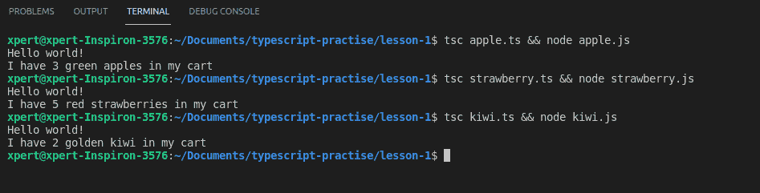
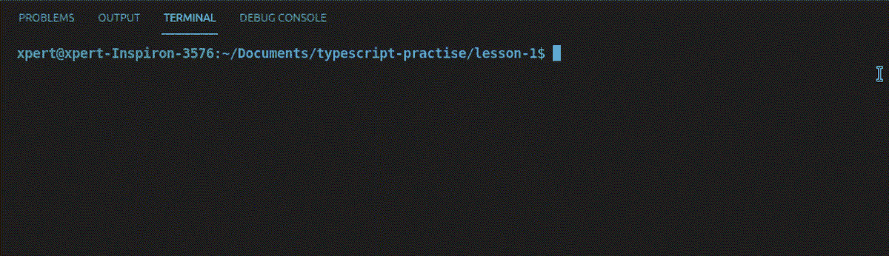

# 如何在 TypeScript 中声明一个模块？

> 原文:[https://www . geeksforgeeks . org/如何声明类型脚本中的模块/](https://www.geeksforgeeks.org/how-to-declare-a-module-in-typescript/)

模块是一段可以在另一段代码中调用或使用的代码。Typescript 中没有关于模块的新内容。该模块的概念是由 JavaScript 在 ECMAScript 2015 版本中引入的。Typescript 只是在重复使用这个功能。

**没有模块，代码就不能工作吗？**

当然会。代码仍然有效。但是没有模块化的代码有很大的缺点。

假设我们创建了一个非常基本的聊天应用程序，可以发送或接收短信。最初，我们只在 2-3 个文件中添加了全部代码，应用程序运行良好。后来我们决定增加一个功能来记录和发送音频信息。为此，我们再次向相同的文件中添加了更多的代码，应用程序仍然运行良好。后来，我们决定增加一些功能，比如共享图像或视频，或者一些大文档，我们继续将代码转储到相同的文件中，或者 1 到 2 个额外的文件中。现在有一个问题。以下是我们可以预见的几个问题:

1.  我们的应用程序将开始变得缓慢(或一度超级缓慢)。
2.  应用程序频繁崩溃，导致潜在的数据丢失
3.  代码库将变成意大利面条(无法维护)
4.  Bug 修复或调试是另一个大问题
5.  测试团队的噩梦

如果我们只是让我们的代码更加模块化，所有上述问题(以及更多)都可以得到解决。

**不使用模块的开发工作:**我们来模拟一个场景。我们想买一些水果。也许苹果、猕猴桃和草莓。我们将为所有 3 个类创建 3 个单独的类。因为这三种都是水果，所以它们有一些共同的特征，比如名字、颜色和数量。因此，我们将用一个方法再创建一个类(作为数据类型)。让我们一个一个地创建类。

**1。创建苹果类:**右键单击项目文件夹，然后单击“新建文件”。称之为 *apple.ts.* 首先我们将在这里定义水果类，用作苹果的数据类型，在同一个文件中，我们还将为苹果定义类:

## java 描述语言

```
class Fruit {

  // Properties that every fruits have
  name: string;
  color: string;
  quantity: number;

  // To initialize the values
  constructor(name, color, quantity) {
      // Initialize values using this operator
  }

  myCart() {
     // A simple placeholder text
      console.log("I have " + this.quantity +
      " " + this.color + " " + this.name +
      " in my cart");
  }
}

class Apple {
  // Initialize Fruits class with values
  fruits: Fruits = new Fruits(..., ..., ...);

  constructor() {
  // call method to see everything is correct
      this.fruits.myCart();
  }
}

// initialize apple class and call
// its constructor automatically
var obj: Apple = new Apple();
```

我们将对猕猴桃班进行同样的程序

**2。创建猕猴桃类:**右键单击项目文件夹，然后单击“新建文件”。称之为*猕猴桃*首先，我们将在这里定义水果类作为猕猴桃的数据类型，在同一个文件中，我们还将为猕猴桃定义类:

## java 描述语言

```
class Fruit {

  // Properties that every fruits have
  name: string;
  color: string;
  quantity: number;

  // Initialize the values
  constructor(name, color, quantity) {

      // Initialize values using this operator
  }

  myCart() {

     // A simple placeholder text
      console.log("I have " + this.quantity +
      " " + this.color + " " + this.name +
      " in my cart");
  }
}

class Kiwi {

  // Initialize Fruits class with values
  fruits: Fruits = new Fruits(..., ..., ...);

  constructor() {

  // Call method to see everything is correct
      this.fruits.myCart();
  }
}

// Initialize kiwi class and
// call its constructor automatically
var obj: Kiwi = new Kiwi();
```

**3。创建草莓类:**右键单击项目文件夹，然后单击“新建文件”。称之为*草莓. ts.* 首先，我们将在这里定义水果类，用作草莓的数据类型，在同一个文件中，我们还将为草莓定义类:

## java 描述语言

```
class Fruit {

  // Properties that every fruits have
  name: string;
  color: string;
  quantity: number;

  // Initialize the values
  constructor(name, color, quantity) {

      // Initialize values  using this operator
  }

  myCart() {

     // A simple placeholder text
      console.log("I have " + this.quantity +
      " " + this.color + " " + this.name +
      " in my cart");
  }
}

class Strawberry {

  // Initialize Fruits class with values
  fruits: Fruits = new Fruits(..., ..., ...);

  constructor() {

      // Call method to see everything is correct
      this.fruits.myCart();
  }
}

// Initialize strawberry class and
// call its constructor automatically
var obj: Strawberry = new Strawberry();
```

**使用模块化方法减少开发工作:**上述方法存在一个重大缺陷。是的，你是对的。一次又一次地重新定义同一个水果类是极其愚蠢的。这就是模块进入画面的地方。如果我们将水果类保存在一个文件中，并将其称为一个模块，然后在任何需要的地方调用该类/模块，会怎么样。这将节省开发人员相当多的时间和精力。让我们快点。

**步骤 1:** 创建一个名为水果. ts 的新文件

**步骤 2:** 从所有 3 个类别中删除水果类别定义

**第三步:**只粘贴在一个位置，即文件*水果*

## java 描述语言

```
export class Fruit {

  // Properties that every fruits have
  name: string;
  color: string;
  quantity: number;

  // Initialize the values
  constructor(name, color, quantity) {

      // Initialize values using this operator
  }

  myCart() {

     // A simple placeholder text
      console.log("I have " + this.quantity +
      " " + this.color + " " + this.name +
      " in my cart");
  }
}

console.log("Hello world!");
```

注意，我们首先使用的是 export 关键字。Export 关键字实际上使得我们的类(或接口)可以在项目的其他地方使用。同时，我们在想要使用导出模块的模块中使用 Import 语句。

还要注意，我们在文件末尾添加了一个控制台日志语句。这不是必需的，但是我们想在本文后面告诉您一个重要的事实。现在，你可以忽略它，假设它不存在。

当我们准备好模块后。我们可以在课堂上称之为。从技术上来说，我们称之为“*进口*”，我们使用了一个名为“*进口*的关键词。

**语法:**

```
import {classname} from './location';
```

让我们快速导入相同的内容:

**文件名:Apple.ts**

## java 描述语言

```
import { Fruits } from './main';

class Apple {
  fruits: Fruits = new Fruits('apples', 'green', 5);
  constructor() {
      this.fruits.myCart();
  }
}
var obj: Apple = new Apple();
```

**文件名:猕猴桃. ts**

## java 描述语言

```
import { Fruits } from './main';
class Kiwi {
  fruits: Fruits = new Fruits('kiwi', 'golden', 2);
  constructor() {
      this.fruits.myCart();
  }
}
var obj: Kiwi = new Kiwi();
```

T1】文件名:草莓. ts

## java 描述语言

```
import { Fruits } from './main';
class Strawberry {
  fruits: Fruits = new Fruits('strawberries', 'red', 5);
  constructor() {
      this.fruits.myCart();
  }
}
var obj: Strawberry = new Strawberry();
```

看看看起来多干净。现在很容易理解，也很容易维护。这就是模块化方法背后的全部思想。

**一些遗留点:**我们最后增加了一条控制台语句。这是有原因的。让我首先向您展示输出。



输出

每次我们运行文件时，我们都会得到一个特定于类的输出，而且还会得到“Hello world！”

原因是不属于导出类。那为什么叫它？原因是每当我们导入一个模块时，整个模块都会作为一个简单的程序执行一次，文件中的每一行都会被执行，不管它是否在导出类的大括号中。所以小心你放进去的东西。在专家看来，不应该有任何偏离的代码。在某些方法中使用它们，或者如果不需要，就删除那些语句。

**总结:**所以，模块只不过是一个概念或方法，其中一段代码保持分离并显式导出，以便其他代码可以导入它。我们使用导出关键字使一个类公开可用，并使用导入来使用导出的模块。

**如何执行代码:**

首先，我们将运行:

```
tsc apple.ts
```

然后我们将运行:

```
node apple.js
```

这是因为并非所有的浏览器都像理解 JavaScript 一样理解 Typescript。所以首先必须将 Typescript 编译成 JavaScript，这就是为什么我们使用 node 命令。我们还可以使用 AND 运算符将这两个命令组合在一起:

**对于 Linux:**

```
tsc apple.ts && node apple.js
```

**对于窗户，我可以使用管道操作器:**

```
tsc apple.ts | node apple.js
```

同样，我可以开猕猴桃和草莓班。

**最终输出:**



**最后一个音符:**

这是编写代码的专业方法，全球都在遵循。所以，明天如果你正在写代码或者检查别人的代码，请特别注意代码模块化。这会让你的生活更轻松。