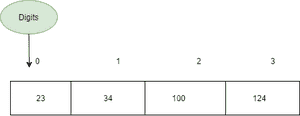

# 如何在 TypeScript 中定义不同泛型类型的数组？

> 原文:[https://www . geesforgeks . org/如何定义不同泛型类型的数组-in-typescript/](https://www.geeksforgeeks.org/how-to-define-an-array-of-different-generic-types-in-typescript/)

在 typescript 中，数组是一种可以顺序存储不同数据类型的多个值的数据类型。与 JavaScript 类似，Typescript 支持数组声明，有多种方法可以实现。

**声明和初始化数组:**

*   我们可以使用 var 或 let 来声明数组。
*   不同的是，如果我们希望变量在整个程序中得到反映/实现*和**让**用于一个*特定的*块，则使用 **var** 。*
*   *以下是语法*

***方法 1:在单独的行上声明和初始化:**这里我们在单独的行上声明一个数组并初始化，如下例所示。它通常用于产生更清晰可读的代码。如果我们已经知道数组的类型，我们就使用方括号，如果我们使用泛型(不局限于一种数据类型)，我们就使用箭头括号。*

> *var Arrayname[:数据类型]；//声明*
> 
>  *Arrayname = [val1、val2、val3、val-什么] //初始化*

*

从 0 开始的数组声明和初始化* 

*这里我们用泛型类型数字来声明数字数组，所以第一个数字 23 表示数组的类型(数字)。如果我们不声明数组的类型，它就被归类为任意。*

## *java 描述语言*

```html
*var fruits: Array<string>;
fruits = ['Kiwi', 'Plums', 'Peaches','Apples','Lime','Cherries'];

var Digits: Array<number>;
Digits = [23, 34, 100, 124,];*
```

***方法 2:在同一行声明和初始化:**在同一行声明和初始化数组的替代方法。*

*示例:*

## *java 描述语言*

```html
*/* First method of usual array with
square brackets and second method of
generic arrays for examples fruits
and Digits */

var fruits: string[] = ['Kiwi', 'Plums',
    'Peaches', 'Apples', 'Lime', 'Cherries'];

var fruits: Array < String >= ['Kiwi', 'Plums',
    'Peaches', 'Apples', 'Lime', 'Cherries'];

var Digits: number[] = [23, 34, 100, 124];
var Digits: Array < number >= [23, 34, 100, 124]*
```

*请注意，第一种方法和第二种方法之间的区别纯粹是为了更清晰的代码。*

***声明多类型数组:**每个类型的类型用“|”分隔，每个类型对应于前一个元素。在下面的例子中，国家的首都是成对的(泰国代表曼谷，新德里代表印度)，在第二个例子中，我们没有数字 5 的字符串，这意味着它是独立的，像其他元素一样占据空间。*

## *java 描述语言*

```html
*/* In the first example we're associating
string with string and second example
vivek has 2 values 3 and 5, as we can have
multiple values */
var Capital: (string | string)[] = ['USA',
    'Washington D.C.', 'United Kingdom',
    'London', 'India', 'New Delhi',
    'Thailand', 'Bangkok'
];
// or
var Employees: Array < string | number >
    = ['Atul', 1, 'Vivek', 3, 5, 'Sania', 8];*
```

***访问数组元素:***

***方法 1:索引访问(直接访问):**当我们知道数组的索引和大小时，直接访问是可能的。在上面的例子中，我们知道“黑暗”占据 1 个索引，因此我们巧克力[1]，它返回白色。然而，如果数组长度太长，就很繁琐，因此我们使用第二种方法(循环)。*

## *java 描述语言*

```html
*var Chocolates: string[] = ['White',
    'Dark', 'SemiSweet', 'BitterSweet'];

Chocolates[0]; // Returns White
Chocolates[1]; // Returns Dark
Chocolates[2]; // Returns SemiSweet
Chocolates[3]; // Returns BitterSweet
Chcoloates[4]; // Returns undefined*
```

***方法 2:使用循环:**数组的大尺寸可能是使用循环而不是直接访问来减少代码行和更干净的代码。在下面的例子中，我们使用 for 循环来解析城市数组，并相应地打印它。*

*或者，如果我们不知道数组的大小，我们就在数组中使用“in”来打印。*

## *java 描述语言*

```html
*// Using loop for the given array
let Cities: string[] = ['Pune', 'Mumbai', 'Nagpur'];

for (var i = 0; i < Cities.length; i++) {

    // Output: Pune Mumbai Nagpur
    console.log(Cities[i]);
}

for (var i in Cities) {

    // Output: Pune Mumbai Nagpur
    console.log(Cities[i]);
}*
```