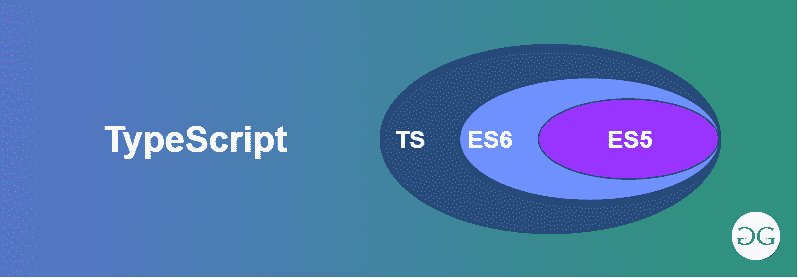

# 如何使用命令行执行 TypeScript 文件？

> 原文:[https://www . geesforgeks . org/如何使用命令行执行-typescript-file/](https://www.geeksforgeeks.org/how-to-execute-typescript-file-using-command-line/)



[**TypeScript**](https://www.geeksforgeeks.org/hello-world-in-typescript-language/) 是一种开源编程语言。它由微软开发和维护。TypeScript 在语法上遵循 JavaScript，但增加了更多功能。它是 JavaScript 的超集。为了执行或运行任何类型脚本文件，首先需要安装节点，并使用它在本地系统中全局安装类型脚本。

**Syntax:**

*   要检查节点是否安装好，运行命令如果没有就必须先 [**安装**](https://www.geeksforgeeks.org/installation-of-node-js-on-windows/) 它:

    ```
    node -v
    ```

    *   Now to install typescript, use:

    ```
    npm install -g typescript
    ```

    安装 typescript 后，创建一个. ts 文件，例如下面给出的 greet.ts:

    *   **例:**

        ```
        var greet: string = "Greetings"; 
        var geeks: string = "GeeksforGeeks"; 
        console.log(greet + " from " + geeks); 
        // save the file as hello.ts 
        ```

    *   **输出:**

        ```
        Greetings from GeeksforGeeks
        ```

    **过程 1:** 这个 typescript 文件 greet.ts 将在运行时创建一个同名的 javascript 文件。要运行任何类型的脚本文件，有几种方法:
    **语法:**

    *   **步骤 1:** 首先，使用以下命令运行 typescript 文件。这将从 typescript 自动创建一个同名的 javascript 文件。

        ```
        tsc helloWorld.ts
        ```

    *   **步骤 2:** 现在运行 javascript 文件，greet.ts 文件将被执行:

        ```
        node helloWorld.js
        ```

    **程序 2:** 您可以使用一根杆子|和& &合并这两个命令，如下所示:
    **语法:**

    *   **在窗口:**

        ```
        tsc greet.ts | node greet.js
        ```

    *   **在 Linux 或 MacOS 中:**

        ```
        tsc helloWorld.ts && node helloWorld.js
        ```

    **步骤 3:** 您也可以使用以下命令安装 **ts 节点**以及类型脚本:

    **语法:**

    *   **安装:**

        ```
        npm install -g ts-node
        ```

    *   **运行:**

        ```
        ts-node helloWorld.ts
        ```

    **输出:**使用三种方式中的任何一种，输出将保持不变。

    ```
    Greetings from GeeksforGeeks
    ```