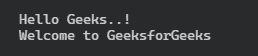

# 如何在 Typescript 中导入模块？

> 原文:[https://www . geeksforgeeks . org/如何导入模块类型脚本/](https://www.geeksforgeeks.org/how-to-import-a-module-in-typescript/)

在开始导入模块之前，首先需要了解 [TypeScript](https://www.geeksforgeeks.org/introduction-to-typescript/) 中模块的基础知识。

我们知道 [JavaScript](https://www.geeksforgeeks.org/javascript-tutorial/) 从 2015 年的 ES6 版本就有了模块的概念，到 2020 年在大多数网络浏览器和 JavaScript 运行时都有广泛的支持。TypeScript 也共享模块的相同概念。任何包含顶级导入或导出的文件都被视为模块。

该模块旨在排列用 TypeScript 编写并用作本地范围的代码。模块基本上是写在单独文件中的脚本。导入允许您在现有文件中引用它们的源位置。现在我们将了解导入外部模型的不同方法，并知道如何在所需位置使用该模块。

**方法:**在导入任何模块之前，我们需要从另一个文件中导出它。我们可以使用*导出*关键字创建一个模块，也可以使用*导入*关键字在其他模块中使用。我们可以导出基于类的模块和基于函数的模块。如下所示。

**导出基于类的模块的语法:**

```
export class CLASS_NAME {
  constructor(para1 , para2) {}
  Method() {
    console.log("This is class-based Module export" );
  }
}
```

**导出基于函数的模块语法:**

```
export function FUNCTION_NAME {
    console.log("This is function-based Module export");
}
```

**导入外部模块的方式:**在 TypeScript 中，我们使用关键字 ***从*** 导入 和 ***来导入特定模块或命名参数。让我们看看使用导入操作的不同方式。***

**1。导入默认导出:**为了从文件导入默认导出，我们可以从文件的位置使用*，并在它之前使用关键字*导入*，或者我们可以给导入一个特定的名称，即 MODULE_NAME，这使得语法如下。*

```
import MODULE_NAME from './MODULE_LOCATION'
```

**2。导入命名值:**不需要每个文件都导出默认模块，它们可以有许多命名参数，如果我们需要导入一个，我们应该使用如下语法。

```
import { MODULE_NAME } from './MODULE_LOCATION'
```

同样，对于多个模块导入，我们可以使用逗号(，)分隔符来分隔花括号{ }内的双参数名称。如下图所示。

```
import { MODULE_NAME1, MODULE_NAME2, ... , 
    MODULE_NAMEn } from ./MODULE_LOCATION'
```

**3。导入默认导出和命名值的组合:**标题明确了我们需要看到的是相同的语法。为了导入组合，我们应该使用以下语法。

```
import DEFAULT_EXPORT, { MODULE_NAME1, 
    MODULE_NAME2, ... , MODULE_NAMEn } 
    from './MODULE_LOCATION'
```

**4。从模块中导入所有内容:**有时需要从特定文件中导入每个模块，然后可以使用(*)星号导入所有模块，并将其分配给一个对象(OBJ_NAME)，如下所示

```
import * as OBJ_NAME from './MODULE_LOCATION'
```

或者您可以使用:

```
import MODULE = require('LOCATION')
```

现在，我们使用以下示例来实现我们在上面学到的内容:

**示例 1:** 将默认导出模块从一个文件导入到另一个文件。

## 模块 1.ts

```
// Exporting the Default export module
// which is used in another file
// export default keyword used to 
// Export the module
export default function GFG() {
    return "GeeksforGeeks";
}
```

## 模块 2.ts

```
// Importing the default export module 
// from the location of the file.
import GFG from "./MODULE1";

// Creating an object of the
// class which is imported
let msg = GFG();

console.log("This is MSG from ");

console.log(msg);
```

**打印输出的步骤:**首先，将 TypeScript 文件转换为 JavaScript，为此，您需要在各自的终端上运行以下命令。

```
> tsc MODULE2.ts
```

之后，您需要使用节点模块运行一个 JavaScript 文件。如下所示。

```
> node MODULE2.js
```

**输出:**


**示例 2:** 将一个类从一个文件导入到另一个文件。

## 模块 1.ts

```
// Exporting the class which used in another file
// export keyword used to Export the module
export class GFG {
      StringConcat(banner) {
        return "Welcome to " + banner;
      }
}
```

## 模块 2.ts

```
// Importing the module
// from the location of the file.
import { GFG } from "./Module1";

let obj1 = new GFG();

console.log(obj1.StringConcat("GeeksforGeeks"));
```

打印输出的步骤:

```
> tsc MODULE2.ts
> node MODULE2.js
```

**输出:**


**示例 3:** 将所有模块从一个文件导入到另一个文件。

## 模块 1.ts

```
// Export all the classes functions

export function Welcome(str: string) {
  return "Hello " + str + "..!";
}

export class Geeks {
  msg(str1: string) {
    return "Welcome to " + str1;
  }
}
```

## 模块 2.ts

```
// Importing everything from the MODULE1.ts 
// using 'import *' and 'as' keyword

import * as AllImports from "./MODULE1";

// Variables created
let str = "Geeks";
let str1 = "GeeksforGeeks";

// Calling function using common import
// name i.e. AllImport
console.log(AllImports.Welcome(str));

// Object of imported class is created
let obj = new AllImports.Geeks();

// Calling the import class function
// using object name
console.log(obj.msg(str1));
```

**打印输出的步骤:**

```
> tsc MODULE2.ts
> node MODULE2.js
```

**输出:**

