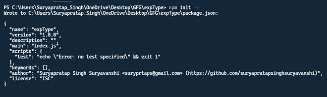
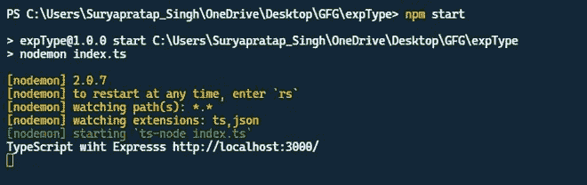
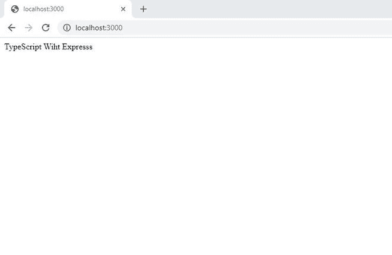

# 如何在打字稿中使用 express？

> 原文:[https://www . geesforgeks . org/如何使用-express-in-typescript/](https://www.geeksforgeeks.org/how-to-use-express-in-typescript/)

在本文中，我们将看到如何在 TypeScript 中使用 Express。**类型脚本**是 JavaScript 的超集，它提供了 JavaScript 的类型标记，所以我们可以处理我们的服务器，并且非常适合未来的扩展。 **Express** 是 web 框架，有助于在 Nodejs 的帮助下创建服务器端处理

**先决条件:**

*   [NodeJS](https://www.geeksforgeeks.org/introduction-to-nodejs/) 和 Express 的基础知识。
*   TypeScript 的基本知识。

**在 Typescript 中创建快速服务器的步骤:**

**步骤 1:** 使用以下命令用您的工作文件夹启动 *package.json* 文件。

```
npm init -y
```

**注意:****'-y '**标志用于进行默认配置。

创建 ***包*** 文件后，下面将输出。



**步骤 2:** 使用以下命令安装所需的模块。

*   为我们的服务器增加一个 *express* 模块。

```
npm install express
```

*   添加*打字稿*和 *ts-node* 在 NodeJS 上运行打字稿。

```
npm i typescript ts-node nodemon --save-dev
```

**注意:****“–保存-开发”**用于添加开发依赖关系。

*   添加类型声明。

```
npm i @types/node @types/express
```

**第三步:**用下面的代码创建一个 ***tsconfig.json*** 文件。

```
{
  "compilerOptions": {
    "target": "es6",
    "module": "commonjs",
    "rootDir": "./",
    "outDir": "./build",
    "esModuleInterop": true,
    "strict": true
  }
}
```

**第四步:**在***package . JSON*****文件中做如下修改，直接运行排版脚本。**

****

****第五步:**用下面的代码创建一个 ***索引文件。在这里，我们用 typescript 创建了一个最小的 express 服务器。这里，文件名是 index.ts。*****

## **java 描述语言**

```
// Import the express in typescript file
import express from 'express';

// Initialize the express engine
const app: express.Application = express();

// Take a port 3000 for running server.
const port: number = 3000;

// Handling '/' Request
app.get('/', (_req, _res) => {
    _res.send("TypeScript Wiht Expresss");
});

// Server setup
app.listen(port, () => {
    console.log(`TypeScript with Express
         http://localhost:${port}/`);
});
```

****步骤 6:** 使用以下命令启动服务器。**

```
npm start
```

****输出:**我们将在终端屏幕上看到以下输出。**

****

****第七步:**打开浏览器，转到***http://localhost:3000***，我们会看到如下输出。** 

****

****参考:****

*   **如果你想了解更多关于打字稿的知识，请参考[打字稿简介](https://www.geeksforgeeks.org/introduction-to-typescript/)一文。**
*   **如果你想了解更多关于快递的知识，请参考[快递简介](https://www.geeksforgeeks.org/introduction-to-express/)一文。**