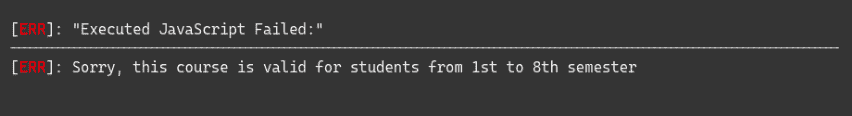

# 如何在 TypeScript 中使用 getter/setter？

> 原文:[https://www . geeksforgeeks . org/如何使用 getter-setter-in-typescript/](https://www.geeksforgeeks.org/how-to-use-getters-setters-in-typescript/)

在 TypeScript 中，有两种受支持的方法 getter 和 setter 来访问和设置类成员。在这篇非常短的文章中，我将向您展示包含 getter/setter 方法的 Typescript 访问器。

实际上，getters 和 setters 只不过是您提供对对象属性的访问的一种方式。不像其他面向对象的语言，如 Java、C++等。其中您只能通过 getter 或 setter 方法访问变量，但是在 Typescript 中，您可以直接访问变量(在下面的示例中给出)。这称为类型脚本访问器。

**类型脚本访问器属性的方法:**

*   **getter:** 当你想访问一个对象的任何属性时，这个方法就会出现。getter 也称为访问器。
*   **setter:** 当你想改变一个对象的任何属性时，这个方法就会出现。二传手也被称为变异者。

下面给出的代码是一个**学生**类，有 3 个属性:名称、学期和课程。

```
class Student {
    public name: string;
    public semester: number;
    public course: string;
}
```

要访问**学生**班级的任何财产:

```
let student = new Student();

// You can access Student class variables directly
Student.name = "Aman Rathod";
```

**吸气方法:**

**注意:**对于提取变量值，getter 访问器属性是常规方法。在对象文字中，它由 get 关键字表示。吸气剂可以是公共的、受保护的、私有的。

**语法:**

```
get accessName() {  
    // getter, the code executed on 
    // getting obj.accessName  
}
```

**示例:**

## java 描述语言

```
class Student {

    private _name: string = "Aman Rathod";
    private _semester: number;
    private _course: string;

    // Getter method to return name of
    // Student class
    public get name() {
        return this._name;
    }

}

// Access any property of the Student class
let student = new Student();

// Getter call
let value = student.name;

console.log(value);
```

**输出:**

```
Aman Rathod
```

从上面的例子中，您可以观察到，当我们调用 getter 方法(student.name)时，我们没有像在常规函数中那样包括左括号和右括号。因此，您可以直接访问变量。

**Setter 方法:**为了更新变量的值，Setter 访问器属性是使用的常规方法。它们由对象文字中的 set 关键字表示。

**语法:**

```
set accessName(value) {  

    // The code executed on setting 
    // obj.accessName = value, from setter  
}  
```

**示例:**

## java 描述语言

```
class Student {

    private _name: string = "Aman Rathod";
    private _semester: number;
    private _course: string;

    // Getter method to return name
    // of Student class
    public get name() {
        return this._name;
    }

    // Setter method to set the semester number
    public set semester(thesem: number) {
        this._semester = thesem;
    }

    // Setter method
    public set course(thecourse: string) {
        this._course = thecourse;
    }
}

// Access any property of the Student class
let student = new Student();

// Setter call
student.semester = 5;
student.course = "Web Development";
```

从上面的例子中，您还可以注意到对 setter 方法的调用不像常规方法那样有括号。当您调用 student .学期或 student.course 时，会调用学期或课程设置器方法并赋值。

**处理错误:**您也可以在 setter 方法中添加一个条件，如果该条件无效，它会抛出一个错误。让我们通过下面的例子来理解。

## java 描述语言

```
class Student {    
    private _name: string = "Aman Rathod";
    private _semester: number;
    private _course: string;

    // Suppose the only 1st to 8th-semester students
    // are allowed to purchase the courses.
    public set semester( thesem: number ) {

        if( thesem < 1 || thesem > 8 ){
            throw new Error(
'Sorry, this course is valid for students from 1st to 8th semester');
        }

        this._semester = thesem;
    }
}

// Access any property of the Student class
let student = new Student();

// setter call
student.semester = 9;
```

**输出:**



**构造函数:**现在我们来讨论一下使用**构造函数**的 Getter 和 Setter 方法。实际上，在一个类中使用或不使用构造函数来访问 getter 或 setter 方法没有区别，但是我们只想忽略 TypeScript 中的构造函数。

**示例:**

## java 描述语言

```
class Student {
    name: string;
    semester: number;
    course: string;

    constructor(nm: string, sm: number, cs: string) {
        this.name = nm;
        this.semester = sm;
        this.course = cs;
    }

    // Getter method 
    public get courses() {
        return this.course;
    }

    public set courses( thecourse: string) {
        this.course = thecourse;
    }
}

// Access any property of the Student class, 
let student = new Student("Aman Rathod", 4, "Web Development" ); 

// Setter call
student.course = "Data structure";

// Getter call
console.log("Course purchased is " + student.courses);
```

**输出:**

