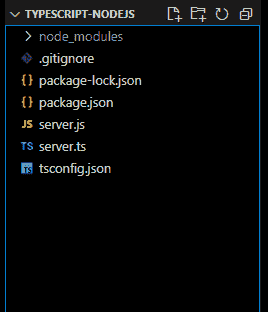
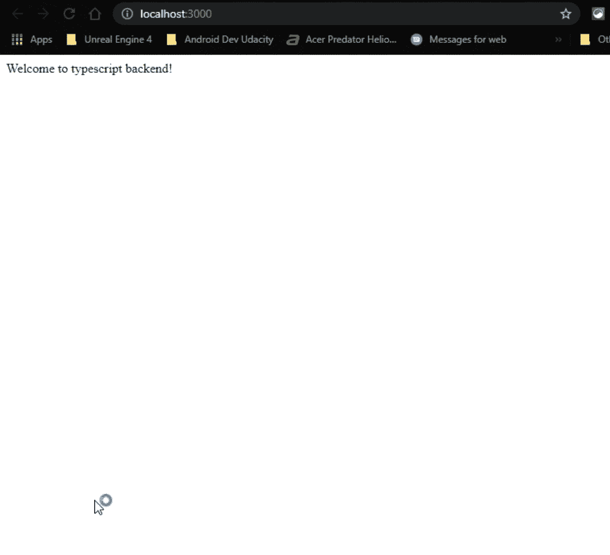

# 如何在后端使用 TypeScript？

> 原文:[https://www . geesforgeks . org/how-to-use-type script-on-后端/](https://www.geeksforgeeks.org/how-to-use-typescript-on-backend/)

TypeScript 是由微软开发的，目的是简化 JavaScript 代码，使其更容易阅读和调试。它的类型检查防止了运行时许多可怕的错误。在本文中，我们将看到如何使用 NodeJS 和 express 在后端设置 typescript。

**先决条件**

*   [节点基础知识](https://www.geeksforgeeks.org/nodejs-tutorials/)
*   [表示](https://www.geeksforgeeks.org/introduction-to-express/)的基础
*   [JavaScript 基础知识](https://www.geeksforgeeks.org/javascript-tutorial/)

**项目设置和模块安装:**

**步骤 1:** 在命令提示符/bash/console 中运行以下命令创建节点项目

```
npm init -y
```

**步骤 2:** 使用以下命令添加所需的依赖项。

```
npm i express 
npm i typescript ts-node @types/node @types/express --save-dev
npm i -D @types/express
```

注意打字稿的[开发依赖](https://www.geeksforgeeks.org/what-is-the-difference-between-save-and-save-dev-in-node-js/)。Typescript 只在开发过程中需要，最终会编译到 *VanillaJS* 中运行。了解更多关于[类型的依赖关系](https://www.geeksforgeeks.org/difference-between-dependencies-devdependencies-and-peerdependencies/)。

**项目结构:**会是这样的



**步骤 3:** 使用以下命令配置类型脚本。

```
npx tsc --init
```

它将生成 **tsconfig.json** ，在这里您可以定义类型脚本的参数，比如使用哪个 ECMAScript 版本*(比如 ES3(默认)、ES5、ES2015)*是否启用严格的类型检查。了解更多关于[打字稿配置](https://www.staging-typescript.org/tsconfig)的信息。

**第四步:**创建一个快递服务器，这里我们把它命名为*服务器*

## server.ts

```
// Importing module
import express from 'express';

const app = express();
const PORT:Number=3000;

// Handling GET / Request
app.get('/', (req, res) => {
    res.send('Welcome to typescript backend!');
})

// Server setup
app.listen(PORT,() => {
    console.log('The application is listening '
          + 'on port http://localhost:'+PORT);
})
```

**步骤 6:** 配置 package.json

在 *package.json* 文件中添加以下一行代码， ***tsc*** 命令将 typescript 代码编译为 Vanilla JavaScript，而 ***节点 server.js*** 将取生成的 Vanilla JavaScript 文件并启动服务器。

```
"scripts": {
 "build": "tsc",
 "start": " node server.js"
}
```

**步骤 7:** 使用以下命令运行服务器。

```
npm run build
npm start
```

**输出:**现在在任意浏览器打开***http://localhost:3000***查看服务器运行情况。

