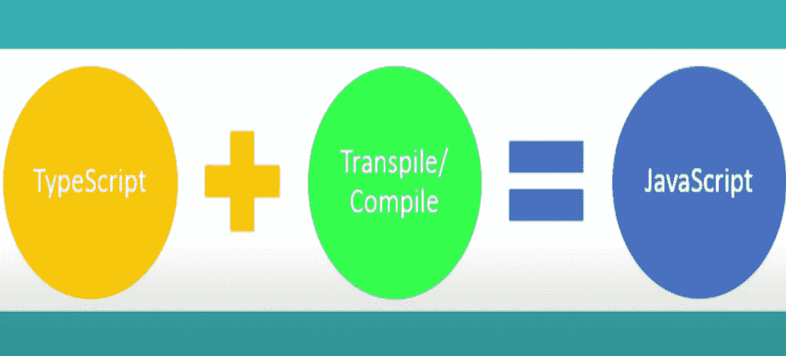
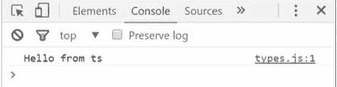

# 打字稿介绍

> 原文:[https://www.geeksforgeeks.org/introduction-to-typescript/](https://www.geeksforgeeks.org/introduction-to-typescript/)

TypeScript 是由微软公司开发和维护的开源[面向对象编程语言](https://www.geeksforgeeks.org/introduction-of-object-oriented-programming/)。TypeScript 是一种强类型语言，其第一个版本于 2012 年推出。这是一个严格的 JavaScript 超级集合，这意味着任何用 JavaScript 实现的东西都可以使用 TypeScript 来实现，并可以选择添加增强的功能(每个现有的 JavaScript 代码都是有效的 TypeScript 代码)。由于 TypeScript 代码被转换为 JavaScript 代码，因此更容易集成到 JavaScript 项目中。它主要是为大型项目设计的。

**类型脚本=== > > > JavaScript +类型+一些新增功能**

【TypeScript 提供了什么？

1.  **静态类型检查**(可选)–像 Java、C 等其他高级编程语言一样。与 JavaScript 不同，TypeScript 确实提供静态类型检查。虽然静态打字在编写代码时需要一些额外的步骤，但它有自己的优势。使用 TypeScript，我们可以检查和分配变量、参数和函数类型。它完全是可选的，可以帮助我们发现和防止错误。还有助于提高代码的可读性和描述性。
2.  **基于类的对象–**另一个巨大的优势是使用类，它提供了在我们的应用程序中使用真正的面向对象编程的能力，并防止使用基于原型的对象。它还提供封装、继承和修饰符。
3.  **模块化–**它有助于使代码更加模块化。
4.  **ES6 特性–**对 ES6 特性的支持也是其受欢迎的主要原因之一。
5.  **语法–**TypeScript 提供了更接近 java 和其他高级语言的语法(语法美化)。

TypeScript 代码不能由浏览器直接解释，因此需要将 TypeScript 代码编译成普通的 JavaScript 代码，为此我们需要 TypeScript 编译器(tsc)。



**类型脚本编译器(tsc)**

*   用 TypeScript 本身编写。
*   编译。ts 文件到。js 文件。
*   作为 NPM 软件包(NodeJS)安装。
*   支持 ES6 语法。

<figure class="table">

| **打字稿** | **JavaScript** |
| 它是一种面向对象的语言(基于类) | 它是一种基于对象的语言(基于原型) |
| 静态类型语言 | 动态类型语言 |
| 支持模块 | 不支持模块 |
| 在编译时/开发期间提供错误 | 不提供编译时错误 |
| 因为需要编译代码，所以需要更多的时间 | 不需要编译 |

</figure>

**为什么 TypeScript 越来越受欢迎？**

*   JavaScript 最初被开发为一种重量轻、易于学习的语言，主要专注于简单的 [DOM](https://www.geeksforgeeks.org/dom-document-object-model/) 操作，但标准随着时间的推移而变化，这就是 TypeScript 出现的地方，因为它为 JavaScript 增加了增强的功能。
*   对类和对象的支持也是它越来越受欢迎的主要原因之一，因为与本机 JavaScript 提供的基于标准原型的实现相比，它更容易理解和实现 OOPS 概念。
*   另外，在像 Angular 这样的流行 JavaScript 框架中使用 TypeScript 有助于 TypeScript 获得兴趣。

**我们为什么要使用 TypeScript？**

1.  **更好的开发人员体验–**TypeScript 的最大优势之一是使 ide 能够提供更丰富的环境，以便在您键入代码时发现常见错误。对于一个大规模的项目，采用 TypeScript 可能会产生更健壮的软件，同时仍然可以部署在运行普通 JavaScript 应用程序的地方。
2.  **代码质量–**一开始定义数据结构，使用类型和接口，迫使你从一开始就考虑应用的数据结构，做出更好的设计决策。
3.  **防止 bug–**TypeScript 不会让你的软件没有 bug。但是它可以防止许多与类型相关的错误。除了聪明的智能感知，许多浏览器和集成开发环境都支持通过源代码映射进行直接调试。
4.  **活跃社区–**TypeScript 越来越受欢迎。谷歌、Airbnb、Shopify、Asana、Adobe 和 Mozilla 等顶级科技公司都在使用它，因此我们可以假设它在可扩展性方面达到了他们的预期——因为他们正在开发大型复杂的应用程序。
5.  **TypeScript Is Just JavaScript–**TypeScript 以 JavaScript 开头，以 JavaScript 结尾。Typescript 从 JavaScript 中采用程序的基本构建块。出于执行的目的，所有 TypeScript 代码都被转换为其等效的 JavaScript。

*“通常情况下，TypeScript 最终被采用的方式——在企业、初创企业和个人开发者中——是你在一个项目上尝试它，然后你说‘哇，这太棒了！’然后你开始传播福音，它在你的势力范围内本地生长。”* —安德斯·海尔斯伯格(核心开发者类型脚本)。

**示例:**

## index.html

```
<!DOCTYPE html>
<html>

<body>
    <h2>Welcome To GFG</h2>

    <p>
        Default code has been 
        loaded into the Editor.
    </p>

    <script src="types.js"></script>
</body>

</html>
```

## types.ts

```
let myString: string;

myString = 'Hello from ts'

console.log(myString);
```

保存上述文件后，我们需要将**类型脚本代码**转换成文件。

在终端中，键入以下命令:

```
tsc types.js (syntax : tsc filename). 
```

成功编译一个与**同名的 **JavaScript** 文件。将创建 js** 扩展，即***type . js***包含相同目录中的 transpiled 代码。现在运行 index.html，可以看到下面的输出。如上所述，类型脚本代码被转换成标准的 JavaScript 代码。

**在 types.js 文件中生成的 JavaScript 代码:**

## java 描述语言

```
var myString;
myString = 'Hello from ts';
console.log(myString);
```

**输出:**

