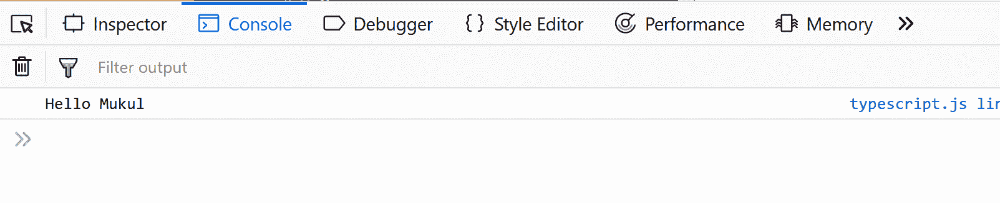
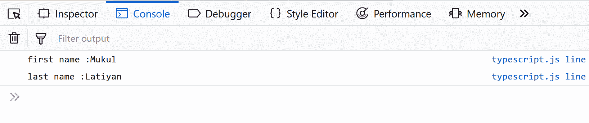
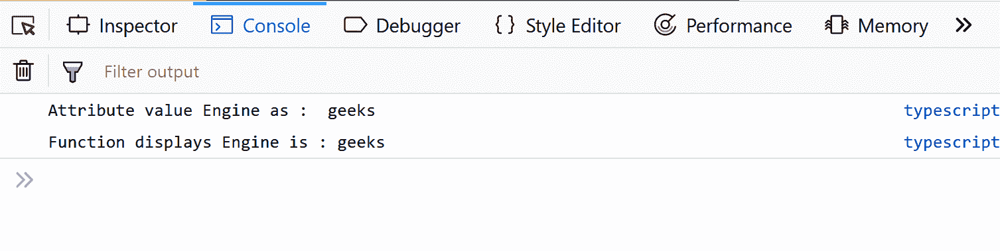

# 类型脚本类

> 原文:[https://www.geeksforgeeks.org/typescript-class/](https://www.geeksforgeeks.org/typescript-class/)

就面向对象编程而言，类是用于创建对象的蓝图。类是具有公共属性的对象的集合。它包含方法、构造函数、块、嵌套类、接口等。对象基本上是具有某些属性的实体，如现实世界中的对象(椅子、桌子等)。
Typescript 是一种基于 Javascript 构建的开源编程语言，也被称为 Javascript 的超集。与 Javascript 相比，Typescript 有更多的特性。它支持面向对象的编程特性，如类、接口、多态性等。

**声明类的语法:**

```
// typescript code
class class_name{
    field;
    method;
}
```

上述代码在传递到 typescript 编译器时，将被转换为下面显示的 javascript 代码。我们可以自由使用任何名称来代替类名。

```
// code converted to javascript
var class_name = /** @class */ (function () {
    function class_name() {
    }
    return class_name;
}());
```

**注意:**使用保存类型脚本代码。ts 扩展。
我们也来看看一些打字稿的例子:

```
// typescript code
class Student {
    studCode: number;
    studName: string;

    constructor(code: number, name: string) {
        this.studName = name;
        this.studCode = code;
    }
    getGrade() : string {
        return "A+" ;
     }
} 
```

该示例声明了一个 Student 类，该类有两个字段，即 **studCode** 和 **studName** ，以及一个构造函数，该构造函数是负责变量或对象初始化的特殊类型的函数。这里是参数化构造函数(已经有了参数)。以及**这个**关键字，它指的是类的当前实例。 **getGrade()** 是一个返回字符串的简单函数。
上述类型脚本代码将转换为如下所示的 javascript 代码:

```
// converted javascript code
var Student = /** @class */ (function () {
    function Student(code, name) {
        this.studName = name;
        this.studCode = code;
    }
    Student.prototype.getGrade = function () {
        return "A+";
    };
    return Student;
}());
```

**对象**
对象是包含一组键值对的类的实例。它的值可能是标量值或函数，甚至是其他对象的数组。
**对象的语法如下所示:**

```
// simple object code in javascript
let object_name = { 
   key1: “value”,  
   key2: function() {
      //functions 
   }, 
   key3:[“content1”, “content2”] //collection  
};
```

对象可以包含标量值、函数和结构，如数组和元组。
我们用一个简单的例子来看看:

```
// simple javascript code
let person = {
   fName:"Mukul", 
   lName:"Latiyan", 
   Hello:function() {  }  //Type template 
} 
person.Hello = function() {  
   console.log("Hello "+person.fName)
}  
person.Hello()
```

**输出:**


```
// typescript object example
var person = { 
   fname:"Mukul", 
   lname:"Latiyan" 
}; 
var hello = function(obj: { fname:string, lname :string }) { 
   console.log("first name :"+obj.fname) 
   console.log("last name :"+obj.lname) 
} 
hello(person)
```

**输出:**

用于创建实例对象。
要创建类的实例，使用 **new** 关键字，后跟类名。在运行时借助**新**为对象分配内存。比如:

```
let object_name = new class_name([ arguments ])
```

为了创建一个对象的实例，我们可以做一些类似下面的代码。

```
let obj = new Student();  
```

**访问属性和函数:**
一个类的属性和函数可以被对象访问。在“.”的帮助下点符号或括号符号(["])我们访问一个类的数据成员。

```
//accessing an attribute 
obj.field_name or obj['field_name']

//accessing a function 
obj.function_name()

```

考虑下面的代码:

```
// typescript code
class Car { 
   //field 
   engine:string; 

   //constructor 
   constructor(engine:string) { 
      this.engine = engine 
   }  

   //function 
   display():void { 
      console.log("Function displays Engine is  :   "+this.engine) 
   } 
} 

//create an object 
var o1 = new Car("geeks")

//access the field 
console.log("Reading attribute value Engine as :  "+o1.engine)  

//access the function
o1.disp()
```

编译后，该代码将被转换为如下所示的 javascript:

```
// converted javascript code
var Car = /** @class */ (function () {
    //constructor 
    function Car(engine) {
        this.engine = engine;
    }
    //function 
    Car.prototype.display = function () {
        console.log("Function displays Engine is  :   " + this.engine);
    };
    return Car;
}());
//create an object 
var o1 = new Car("geeks");
//access the field 
console.log("Reading attribute value Engine as :  " + o1.engine);
//access the function
o1.disp();
```

**输出:**
