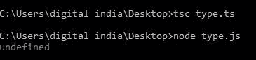
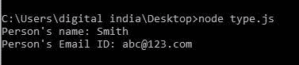

# 类型脚本|字符串原型属性

> 原文:[https://www . geesforgeks . org/typescript-string-prototype-property/](https://www.geeksforgeeks.org/typescript-string-prototype-property/)

[**中的**原型属性()**类型脚本**](https://www.geeksforgeeks.org/hello-world-in-typescript-language/) ，用于向对象添加属性和方法。
**语法:**

```
string.prototype 
```

**返回值:**此方法不返回值。
以下示例说明了打字稿
**中的**字符串原型属性**示例 1:**

## Java Script 语言

```
function Person(name:string, job:string, yearOfBirth:number)
    {    
        this.name= name; 
        this.job= job; 
        this.yearOfBirth= yearOfBirth; 
    } 

    // Driver code
    var emp = new Person("Smith", "ABC",12214) 

    // This will show Person's prototype property.  
    console.log(emp.prototype);
```

**输出:**



**例 2:**

## Java Script 语言

```
function Person(name:string, job:string, yearOfBirth:number)
    {    
        this.name= name; 
        this.job= job; 
        this.yearOfBirth= yearOfBirth; 
    } 

    // Driver code
    var emp = new Person("Smith", "ABC",12214) 

    // This will show Person's prototype property. 
    Person.prototype.email = "abc@123.com"; 

    console.log("Person's name: " + emp.name); 
    console.log("Person's Email ID: " + emp.email);
```

**输出:**

