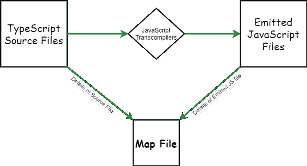

# 什么是 TypeScript 地图文件？

> 原文:[https://www.geeksforgeeks.org/what-is-typescript-map-file/](https://www.geeksforgeeks.org/what-is-typescript-map-file/)

**在开始之前，你应该熟悉以下几个术语:**

1.  **TypeScript 源文件:**这些都是自己写的文件，相当容易解读，也就是说是人可读的。
2.  **发出或传输的 JavaScript 代码:**该代码相当于我们创建的 TypeScript 源文件的 JavaScript 代码，但不是人类可读的。该代码是在像巴贝尔和网络包这样的 JavaScript 代码转换器的帮助下，从类型脚本源文件中生成或创建的，因此代码在旧浏览器上运行良好，而不仅仅是在最新的浏览器上。

**解释:** TypeScript Map 文件是源映射文件，让工具在发出的 JavaScript 代码和创建它的 TypeScript 源文件之间进行映射。这些源映射文件将有助于调试类型脚本文件，而不是调试发出的 JavaScript 文件。许多调试器使用这些 Typescript 映射文件来调试生产中的代码。一个源映射文件，从透明的 JavaScript 文件映射到原始的 TypeScript 文件。

传输或发出的 JavaScript 代码不容易阅读，因为代码可能会被压缩、编译、丑化、缩小，因此不可读。这些文件在生产过程中部署。现在假设在生产中，我们面临一个错误。如何调试它，因为发出的 JavaScript 代码不容易阅读。

这就是 TypeScript 地图文件成为我们救世主的地方。



“那个。地图”文件充当翻译。它包含了类型脚本源代码和发出的 JavaScript 代码的细节。如果您有一个生产 bug，并且您还有一个源代码图，那么您可以轻松地调试生产 bug。您所要做的就是将源代码映射上传到开发工具，在内部，所有浏览器都支持源代码映射，并且发出的 JavaScript 代码已经被翻译成 TypeScript 代码(人类可读的语言)。

**使用 tsconfig.json 文件中的 sourceMap 编译选项生成 TypeScript Map 文件:**

## java 描述语言

```
{
  "compilerOptions": {
   ...
   "sourceMap": true
    },
   ...
}
```

**地图文件的结构:**如果我们查看包含透明 JavaScript 的文件夹，我们会看到源地图。这些是扩展名为. map 的文件。如果我们打开一个源地图文件，我们会看到它是 JSON 格式的:

## java 描述语言

```
{
  "version": 3,
  "file": "home.js",
  "sourceRoot": "",
  "sources": [
    "../src/home.ts"
  ],
  "names": [],
  "mappings": ";;AAAA,uCAAoA;....""
}
`}
```

*   对 JavaScript 文件的引用在**文件**字段中定义。
*   对类型脚本文件的引用在**源**字段中。请注意，它引用了项目结构中的文件。
*   **源根**字段是类型脚本文件的根路径。
*   **映射**字段包含 JavaScript 代码中每个位置到 TypeScript 代码中位置的映射。这些是 base64 编码的可变长度量。
*   **名称**字段是源代码中使用的标识符列表，这些标识符已被更改或从输出中删除。
*   **版本**字段定义正在使用哪个版本的源地图规范。