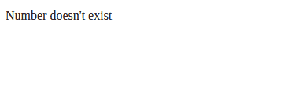

# 如何在下划线. js 模板中使用 if 语句？

> 原文:[https://www . geesforgeks . org/if 语句使用方法-下划线-js-templates/](https://www.geeksforgeeks.org/how-to-use-if-statements-in-underscore-js-templates/)

下划线. js 是一个 javascript 库，它在函数式编程中提供帮助函数，而不扩展内置对象。这个包包括 100 个功能，如地图，过滤器等。

我们可以用 npm 安装这个。

```
npm install underscore
```

**语法:**

```
const _ = require('underscore');
```

**进场:**

*   根据需求写下你的标记代码。

*   我们应该始终将下划线. js 代码放在

*   在这种情况下，根据问题陈述编写 if 和 else 逻辑。

*   一旦代码没有错误，我们就可以像往常一样浏览文件了。

*   这样，我们需要在

**示例:**

```
<!DOCTYPE html>
<html>

<head>
    <script type="text/javascript" src=
"https://cdnjs.cloudflare.com/ajax/libs/underscore.js/1.9.1/underscore-min.js">
    </script>
</head>

<body>
    <script type="text/javascript">
           <% if (typeof (number) != "undefined") {%>
            <span class="number"><%= number %></span>
            <%}
        else {
            print("Number doesn't exist");
        } %>
    </script>
</body>

</html>
```

**输出:**

