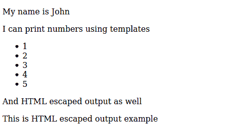

# 如何使用下划线. js 作为模板引擎？

> 原文:[https://www . geesforgeks . org/如何使用-下划线-js-as-a-template-engine/](https://www.geeksforgeeks.org/how-to-use-underscore-js-as-a-template-engine/)

在为网页编写布局时，我们经常要求页面的某些元素具有动态值。对于这样的场景，我们使用模板。模板使我们能够在静态 HTML 代码中嵌入逻辑段，这使得页面基于模板中传递的值是动态的。为了渲染模板，我们需要一个模板引擎。在本文中，我们将讨论流行的 JavaScript 库下划线. js 如何用作模板引擎。

**进场:**

*   **编写模板:**模板包含简单的 HTML，其中嵌入了一些逻辑段。可以通过以下三种方式添加逻辑段:
*   **Rendering the template using underscore.js:** Underscore.js provides **.template()** function which compiles JavaScript templates into functions that can be evaluated for rendering.
    **Syntax:**

    ```
    _.template(templateString, settings)
    ```

    **参数:****_。模板**功能接受两个参数，如上所述，如下所述:

    *   **模板字符串:**包含要渲染的模板的字符串。
    *   **设置(可选):**包含任意 _。应该覆盖的模板设置。

    **返回值:****_。模板**函数返回一个以模板中指定的变量为参数的函数。该函数可以用所需的参数值调用，以获得动态 HTML。

以下示例说明了上述方法:

**示例:**考虑下面指定的模板字符串:

*   **代码 1:**

    ```
    <script>
    var templateString = '<div id="output">
    <p>
        My name is
        <%= name %>
    </p>

    <p> I can print numbers using templates </p>

    <% var numbers = [1, 2, 3, 4, 5]; %>
    <ul>
        <% _(numbers).each(function(number) { %>
            <li>
                <%= number %>
            </li>
        <% }); %>
    </ul>

    <p>And HTML escaped output as well
        <%=htmlEscapedOutput%>
    </p>';
    </script>
    ```

*   **代码 2:** 下面是如何使用下划线来渲染这个模板的:

    ```
    <div id="output"></div>

    <script>
        window.onload = function() {
            var outputDiv = document.querySelector('#output');

            // Obtain the template rendering function
            // from template string
            var templateFunction = _.template(templateString);

            // Render the template with specified parameters
            outputDiv.innerHTML = templateFunction({
                "name": "John",
                "htmlEscaapedOutput":"<div class="title">"+
                "This <span>is HTML escaped output</span> example</div>"
            });
        }
    </script>
    ```

*   **输出:** 