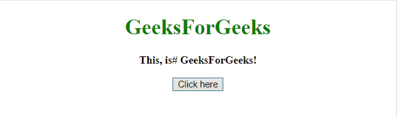
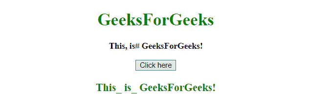
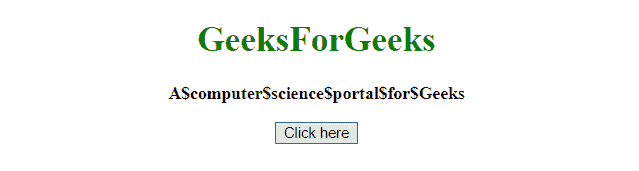
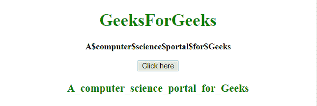

# 用 JavaScript 中的下划线(_)替换字符串中的特殊字符

> 原文:[https://www . geesforgeks . org/用下划线替换字符串中的特殊字符-javascript 中的-_/](https://www.geeksforgeeks.org/replace-special-characters-in-a-string-with-underscore-_-in-javascript/)

JavaScript replace()方法用于用 _(下划线)替换字符串中的所有特殊字符，如下所述:

*   **replace() method:** This method searches a string for a defined value, or a regular expression, and returns a new string with the replaced defined value.

    **语法:**

    ```
    string.replace(searchVal, newvalue)
    ```

    **参数:**

    *   **searchVal:** 必选参数。它指定将被新值替换的值或正则表达式。
    *   **新值:**必选参数。它指定要替换搜索值的值。

    **返回值:**它返回一个新字符串，其中定义的值已被新值替换。

**示例 1:** 本示例使用 **replace()方法**将**所有特殊字符**替换为 **_(下划线)**。

```
<!DOCTYPE HTML> 
<html> 
    <head> 
        <title> 
            Replace special characters in a
            string with _ (underscore)
        </title>
    </head> 

    <body style = "text-align:center;"> 

        <h1 style = "color:green;" > 
            GeeksForGeeks 
        </h1> 

        <p id = "GFG_UP" style = "font-size: 16px; font-weight: bold;">
        </p>

        <button onclick = "gfg_Run()"> 
            Click here
        </button>

        <p id = "GFG_DOWN" style = 
            "color:green; font-size: 20px; font-weight: bold;">
        </p>

        <script>
            var el_up = document.getElementById("GFG_UP");
            var el_down = document.getElementById("GFG_DOWN");
            var str = "This, is# GeeksForGeeks!";
            el_up.innerHTML = str;

            function gfg_Run() {
                el_down.innerHTML = 
                    str.replace(/[&\/\\#, +()$~%.'":*?<>{}]/g, '_');
            }         
        </script> 
    </body> 
</html>                    
```

**输出:**

*   **点击按钮前:**
    
*   **点击按钮后:**
    

**示例 2:** 本示例将唯一的特殊字符替换为 _(下划线)。这个例子对每个字符进行检查，如果它是我们正在寻找的特殊字符，那么它将替换该字符。在本例中，唯一的字符是$(美元符号)。

```
<!DOCTYPE HTML> 
<html> 
    <head> 
        <title> 
            Replace special characters with
            _ (underscore)
        </title>
    </head> 

    <body style = "text-align:center;"> 

        <h1 style = "color:green;" > 
            GeeksForGeeks 
        </h1> 

        <p id = "GFG_UP" style = "font-size: 16px; font-weight: bold;">
        </p>

        <button onclick = "gfg_Run()"> 
            Click here
        </button>

        <p id = "GFG_DOWN" style = 
            "color:green; font-size: 20px; font-weight: bold;">
        </p>

        <script>
            var el_up = document.getElementById("GFG_UP");
            var el_down = document.getElementById("GFG_DOWN");
            var str = "A$computer$science$portal$for$Geeks";
            el_up.innerHTML = str;

            function gfg_Run() {

                var newStr = "";

                for(var i=0; i<str.length; i++) { 
                    if (str[i] == '{content}apos;) {
                        newStr += '_';
                    }
                    else {
                        newStr += str[i];
                    }
                }
                el_down.innerHTML = newStr;
            }         
        </script> 
    </body> 
</html>                    
```

**输出:**

*   **点击按钮前:**
    
*   **点击按钮后:**
    