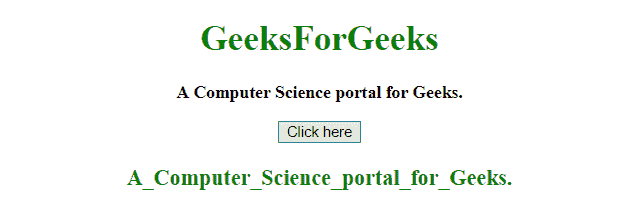

# 在 JavaScript 中用下划线替换空格

> 原文:[https://www . geesforgeks . org/将-空格替换为-下划线-in-javascript/](https://www.geeksforgeeks.org/replacing-spaces-with-underscores-in-javascript/)

给定一个句子，任务是将句子中的**空格(" "**)替换为**下划线(“_”**)。下面列出了一些用下划线替换空格的 JavaScript 方法:

*   **replace() method:** This method searches a string for a defined value, or a regular expression, and returns a new string with the replaced defined value.

    **语法:**

    ```
    string.replace(searchVal, newvalue)

    ```

    **参数:**

    *   **searchVal:** 必选参数。它指定将被新值替换的值或正则表达式。
    *   **新值:**必选参数。它指定要替换搜索值的值。

    **返回值:**它返回一个新字符串，其中定义的值已被新值替换。

*   **split() method:** This method is used to split a string into an array of substrings, and returns the new array.

    **语法:**

    ```
    string.split(separator, limit)

    ```

    **参数:**

    *   **分隔符:**为可选参数。它指定用于拆分字符串的字符或正则表达式。如果不使用，将返回整个字符串(只有一项的数组)。
    *   **极限:**为可选参数。它保存指定拆分数量的整数，超出拆分限制的项目将从数组中排除。

    **返回值:**返回一个新数组，包含拆分后的项目。

**示例 1:** 本示例使用 **replace()方法**将所有**空格(“”)**替换为**下划线(“_”**)。

```
<!DOCTYPE HTML> 
<html> 
    <head> 
        <title> 
            Replacing spaces with underscores
        </title>
    </head> 

    <body style = "text-align:center;"> 

        <h1 style = "color:green;" > 
            GeeksForGeeks 
        </h1> 

        <p id = "GFG_UP" style = "font-size: 16px; font-weight: bold;">
        </p>

        <button onclick = "gfg_Run()"> 
            Click here
        </button>

        <p id = "GFG_DOWN" style = 
            "color:green; font-size: 20px; font-weight: bold;">
        </p>

        <script>
            var el_up = document.getElementById("GFG_UP");
            var el_down = document.getElementById("GFG_DOWN");
            var str = "A Computer Science portal for Geeks.";
            el_up.innerHTML = str;

            function gfg_Run() {
                el_down.innerHTML = str.replace(/ /g, "_");
            }         
        </script> 
    </body> 
</html>                    
```

**输出:**

*   **点击按钮前:**
    
*   **点击按钮后:**
    

**示例 2:** 本示例使用 **split()方法**将所有**空格(“”)**替换为**下划线(“_”**)。它首先用**空格(" "**)分割字符串，然后用**下划线(" _")** 连接字符串。

```
<!DOCTYPE HTML> 
<html> 
    <head> 
        <title> 
            Replacing spaces with underscores
        </title>
    </head> 

    <body style = "text-align:center;"> 

        <h1 style = "color:green;" > 
            GeeksForGeeks 
        </h1> 

        <p id = "GFG_UP" style = "font-size: 16px; font-weight: bold;">
        </p>

        <button onclick = "gfg_Run()"> 
            Click here
        </button>

        <p id = "GFG_DOWN" style = 
            "color:green; font-size: 20px; font-weight: bold;">
        </p>

        <script>
            var el_up = document.getElementById("GFG_UP");
            var el_down = document.getElementById("GFG_DOWN");
            var str = "A Computer Science portal for Geeks.";
            el_up.innerHTML = str;

            function gfg_Run() {
                el_down.innerHTML = str.split(' ').join('_');
            }         
        </script> 
    </body> 
</html>                    
```

**输出:**

*   **点击按钮前:**
    
*   **点击按钮后:**
    