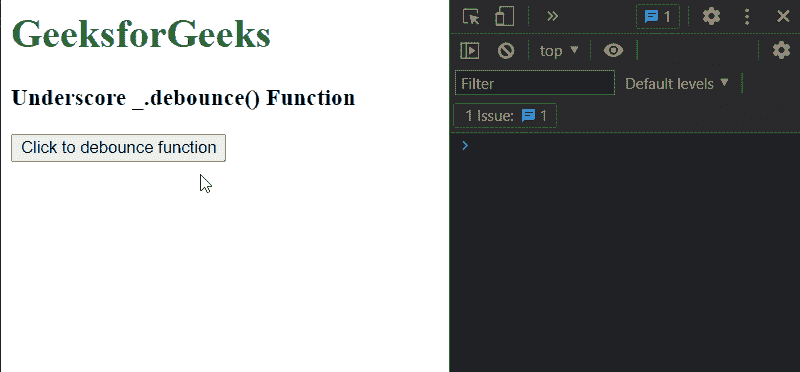
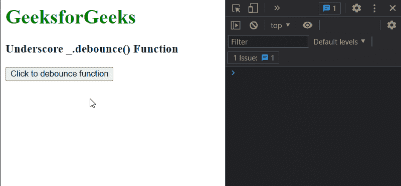

# 下划线 _。去抖()功能

> 原文:[https://www . geesforgeks . org/下划线-_-去抖-函数/](https://www.geeksforgeeks.org/underscore-_-debounce-function/)

**_。Underscore.js 中的去抖()函数**用于创建一个去抖函数，该函数用于延迟给定函数的执行，直到自上次调用该函数以来经过了以毫秒为单位的给定等待时间。去抖函数有一个*取消*方法，可用于取消被延迟的函数调用，还有一个*刷新*方法，用于立即调用被延迟的函数。

**语法:**

```
_.debounce( function, wait, immediate )
```

**参数:**该函数接受三个参数，如上所述，如下所述:

*   **功能:**是必须去抖的功能。
*   **等待:**是呼叫延迟的毫秒数。这是一个可选参数。默认值为 0。
*   **立即:**是布尔值，它指定去抖函数将在序列的开头而不是结尾被调用。这是一个可选参数。

**返回值:**该方法返回新的去抖函数。

下面的例子说明了 _。去抖()函数是下划线

**例 1:**

## 超文本标记语言

```
<html>

<head>
    <script src= 
"https://cdnjs.cloudflare.com/ajax/libs/underscore.js/1.9.1/underscore-min.js">
    </script>
</head>

<body>
    <h1 style="color: green">GeeksforGeeks</h1>
    <h3>Underscore _.debounce() Function</h3>
    <button onclick="debounce_fn()">
        Click to debounce function
    </button>

    <script type="text/javascript">
         var debounce_fn = 
           _.debounce(debounceHandler, 2000, false);

         function debounceHandler() {
            console.log('Hello Geeks!')
         }
    </script>
</body>

</html>
```

**输出:**



**例 2:**

## 超文本标记语言

```
<html>

<head>
    <script src=
"https://cdnjs.cloudflare.com/ajax/libs/underscore.js/1.9.1/underscore-min.js">
    </script>
</head>

<body>
    <h1 style="color: green">GeeksforGeeks</h1>
    <h3>Underscore _.debounce() Function</h3>
    <button onclick="debounce_fn()">
        Click to debounce function
    </button>

    <script type="text/javascript">
         var debounce_fn = 
           _.debounce(debounceHandler, 2000, true);

         function debounceHandler() {
            console.log('Hello Geeks Immediately!')
         }
    </script>
</body>

</html>
```

**输出:**



**参考:**T2】https://underscorejs.org/#debounce