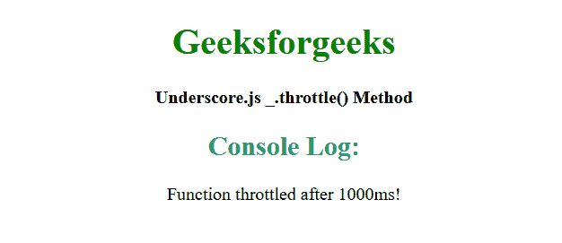

# 下划线 _。节气门()功能

> 原文:[https://www . geesforgeks . org/下划线-_-油门-功能/](https://www.geeksforgeeks.org/underscore-_-throttle-function/)

**_。下划线中的 throttle()方法**用于创建一个 throttled 函数，该函数每等待毫秒最多只能调用 func 参数一次。节流函数有一个 cancel 方法，用于取消被延迟的 func 调用，它还有一个 flush 方法，用于立即调用被延迟的 func。此外，它还提供了一些选项，用于暗示是否应该在等待超时的前沿和/或后沿调用所述函数。
**语法:**

```
_.throttle(function, wait, [options])
```

**参数:**该方法接受如上所述和如下所述的三个参数。

*   **功能:**是需要节流的功能。
*   **等待:**是要抑制呼叫的毫秒数。
*   **选项:**是选项对象。
    *   **options.leading:** 它定义了在超时前沿的调用。
    *   **选项.尾随:**它定义了在超时的后沿调用。

**返回值:**该方法返回新的节流函数。

**例 1:**

## 超文本标记语言

```
<!DOCTYPE html>
<html>

<head>
    <script src=
"https://cdnjs.cloudflare.com/ajax/libs/underscore.js/1.9.1/underscore-min.js">
    </script>
</head>

<body>
    <center>
        <h1 style="color:green;">
            Geeksforgeeks
        </h1>

        <b>Underscore.js _.throttle() Method</b>
    </center>

    <script type="text/javascript">

        // Calling throttle() method with its parameter
        var gfg = _.throttle(function () {
            console.log('Function throttled after 1000ms!');
        }, 1000);

        gfg();
    </script>
</body>

</html>
```

**输出:**



**例 2:**

## 超文本标记语言

```
<!DOCTYPE html>
<html>

<head>
    <script src=
"https://cdnjs.cloudflare.com/ajax/libs/underscore.js/1.9.1/underscore-min.js">
    </script>
</head>

<body>
    <center>
        <h1 style="color:green;">
            Geeksforgeeks
        </h1>

        <b>Underscore.js _.throttle() Method</b>
    </center>

    <script type="text/javascript">

        // Calling throttle() method with its parameter
        var throt_fun = _.throttle(function () {
            console.log('Function throttled after 1000ms!');
        }, 1000);

        // Defining loop
        var loop = function () {
            setTimeout(loop, 5)
            throt_fun();
        };

        // Calling loop to start
        loop();
    </script>
</body>

</html>
```

**输出:**


**参考:**T2】https://underscorejs.org/#throttle